# Evidencias: Despliegue de Motores de Base de Datos — Proyecto MoviCab

**Proyecto:** 09 - MoviCab (Despacho inteligente de taxis)
**Materia:** Desarrollo Web
**Estudiante:** Diego De Luque
**Fecha:**

---

## 1. Requisitos Previos

**Comandos ejecutados:**
```bash
docker --version
docker compose version
```

**Captura:**

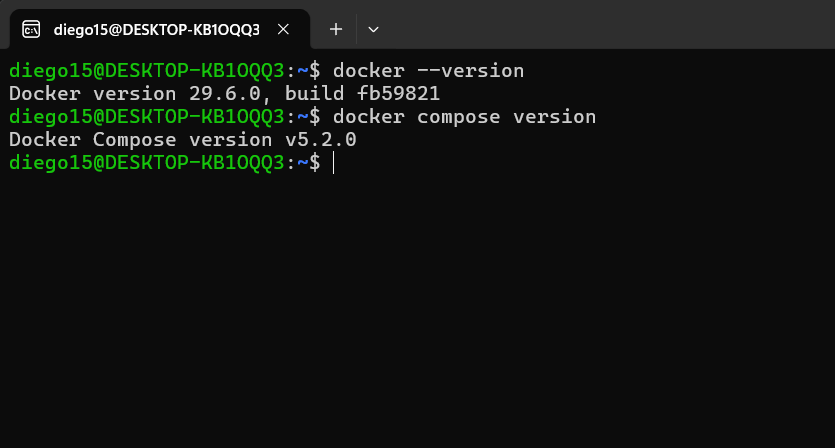

**Descripción:**
WSL2 y Docker ya estaban instalados y en uso previamente en la máquina para otros proyectos en desarrollo. Se verifica que el entorno se encuentra funcional antes de iniciar la actividad.

---

## 2. Crear Carpetas

**Comandos ejecutados:**
```bash
mkdir -p ~/movicab-lab/services/motores-bd/{mysql,postgres,mssql,oracle}
mkdir -p ~/movicab-lab/data/{mysql,postgres,mssql,oracle}
tree ~/movicab-lab/
```

**Captura:**

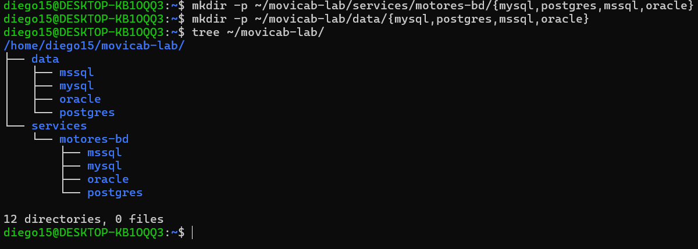

**Descripción:**
Creación de la estructura de carpetas base para la infraestructura de motores de base de datos del proyecto MoviCab, adaptando el nombre de la carpeta raíz de `ia-lab` a `movicab-lab`.

---

## 3. Crear la Red Docker Compartida

**Comandos ejecutados:**
```bash
docker network inspect movicab-network >/dev/null 2>&1 || docker network create movicab-network
docker network ls | grep movicab
```

**Captura:**

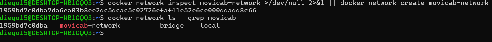

**Descripción:**
Creación de la red Docker `movicab-network`, que permitirá la comunicación entre los 4 motores de base de datos del proyecto.

---

## 4. MySQL

### 4.1 Verificación de puertos disponibles

**Comandos ejecutados:**
```bash
docker ps -a --format "table {{.Names}}\t{{.Image}}\t{{.Ports}}"
ss -tulpn | grep 3306
```

**Captura:**

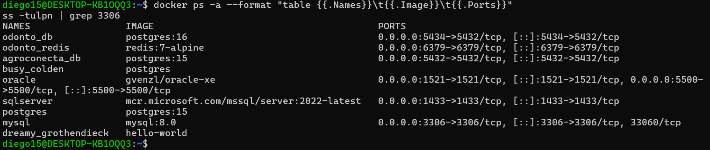

**Descripción:**
Se verificó que el puerto 3306 ya estaba en uso por un contenedor `mysql` existente de otro proyecto, por lo que se reasignó el motor de MoviCab al puerto 3307 para evitar conflictos.

### 4.2 Creación de archivos de configuración

**Comandos ejecutados:**
```bash
cat > ~/movicab-lab/services/motores-bd/mysql/docker-compose.yml << 'EOF'
services:
  mysql:
    image: mysql:8.0
    container_name: mysql-server
    restart: unless-stopped
    env_file:
      - .env
    ports:
      - "3307:3306"
    volumes:
      - ../../../data/mysql:/var/lib/mysql
    command: >
      --character-set-server=utf8mb4
      --collation-server=utf8mb4_unicode_ci
      --bind-address=0.0.0.0
    networks:
      - movicab-network
    healthcheck:
      test: ["CMD", "mysqladmin", "ping", "-h", "localhost"]
      interval: 10s
      timeout: 5s
      retries: 5
      start_period: 30s

networks:
  movicab-network:
    external: true
EOF
```
```bash
cat > ~/movicab-lab/services/motores-bd/mysql/.env << 'EOF'
TZ=America/Bogota
MYSQL_ROOT_PASSWORD=abril152006
MYSQL_DATABASE=movicab_db
EOF
```

**Captura:**

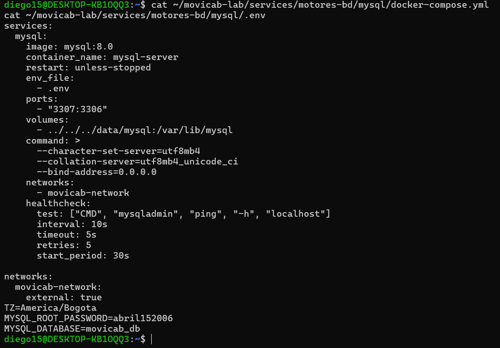

**Descripción:**
Configuración del servicio MySQL 8.0 con base de datos inicial `movicab_db`, publicado en el puerto 3307.

### 4.3 Verificación del contenido de los archivos

**Comandos ejecutados:**
```bash
cat ~/movicab-lab/services/motores-bd/mysql/docker-compose.yml
cat ~/movicab-lab/services/motores-bd/mysql/.env
```

**Captura:**


**Descripción:**
Verificación del contenido real de los archivos `docker-compose.yml` y `.env` creados para el motor MySQL.

### 4.4 Levantar el contenedor y verificar

**Comandos ejecutados:**
```bash
cd ~/movicab-lab/services/motores-bd/mysql
docker compose up -d
docker ps | grep mysql-server
docker logs mysql-server --tail 20
```

**Captura:**

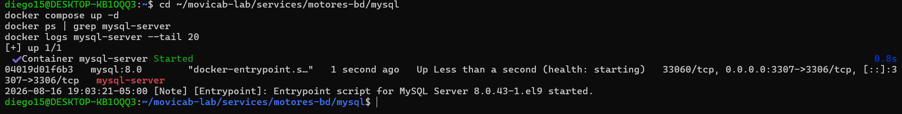

**Descripción:**
Despliegue exitoso del motor MySQL 8.0 en el puerto 3307, corriendo bajo el nombre de contenedor `mysql-server`.

### 4.5 Creación de usuario propio con acceso remoto

**Comandos ejecutados:**
```bash
docker exec -it mysql-server mysql -u root -pabril152006 -e "
CREATE USER 'diego15'@'%' IDENTIFIED BY 'abril152006';
GRANT ALL PRIVILEGES ON *.* TO 'diego15'@'%' WITH GRANT OPTION;
FLUSH PRIVILEGES;
SHOW GRANTS FOR 'diego15'@'%';
"
```

**Captura:**

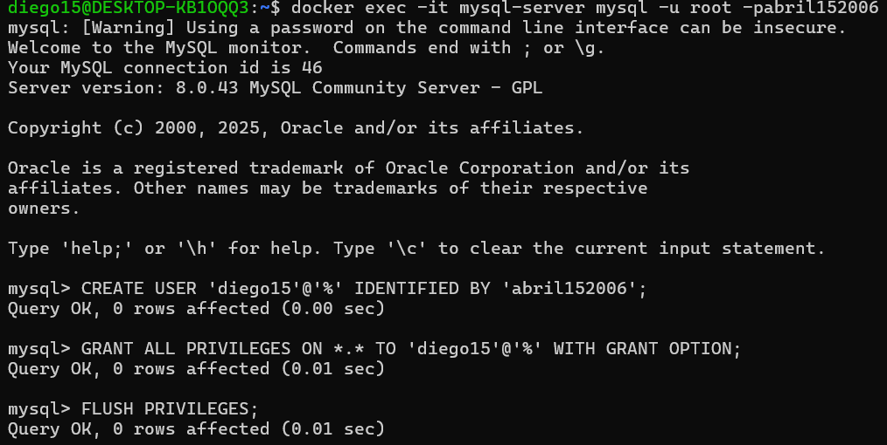

**Descripción:**
Creación del usuario `diego15` con privilegios totales sobre el motor MySQL, con acceso habilitado desde cualquier host.

### 4.6 Prueba de conexión desde DBeaver

**Pasos realizados:**
1. Nueva conexión en DBeaver → MySQL
2. Host: `172.21.129.16` — Puerto: `3307` — Base de datos: `movicab_db` — Usuario: `diego15` — Contraseña: `abril152006`
3. Test Connection

**Captura:**

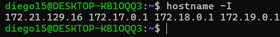

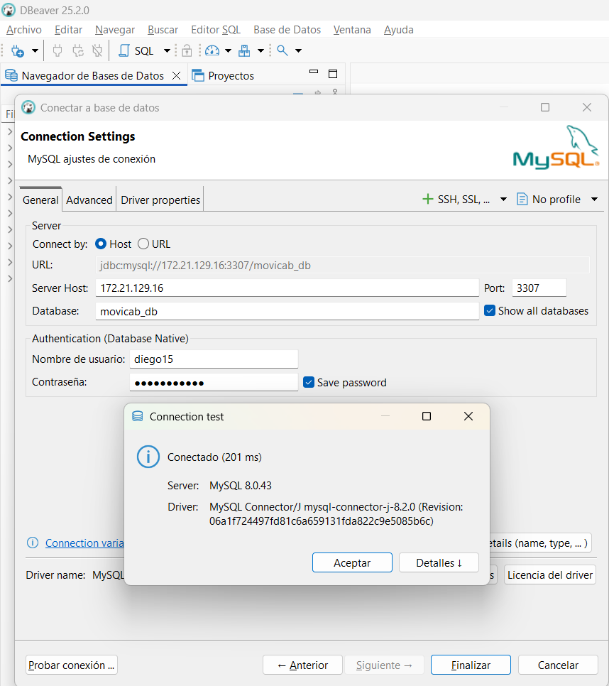

**Descripción:**
Verificación de conexión exitosa al motor MySQL desde el cliente gráfico DBeaver.

---

## 5. PostgreSQL

### 5.1 Verificación de puertos disponibles

**Comandos ejecutados:**
```bash
ss -tulpn | grep 5433
```

**Captura:**

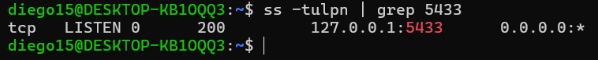

**Descripción:**
Se detectó actividad en el puerto 5433 que no correspondía a ningún contenedor visible en `docker ps -a`, por lo que se optó por usar el puerto 5435 para el motor PostgreSQL de MoviCab.

### 5.2 Creación de archivos de configuración

**Comandos ejecutados:**
```bash
cat > ~/movicab-lab/services/motores-bd/postgres/docker-compose.yml << 'EOF'
services:
  postgres:
    image: postgres:17
    container_name: ia-postgres
    restart: unless-stopped
    env_file:
      - .env
    ports:
      - "5435:5432"
    volumes:
      - ../../../data/postgres:/var/lib/postgresql/data
    networks:
      - movicab-network
    healthcheck:
      test: ["CMD-SHELL", "pg_isready -U $$POSTGRES_USER -d $$POSTGRES_DB"]
      interval: 10s
      timeout: 5s
      retries: 5
      start_period: 20s

networks:
  movicab-network:
    external: true
EOF
```
```bash
cat > ~/movicab-lab/services/motores-bd/postgres/.env << 'EOF'
TZ=America/Bogota
POSTGRES_DB=movicab_db
POSTGRES_USER=movicab
POSTGRES_PASSWORD=abril152006
PGDATA=/var/lib/postgresql/data
EOF
```

**Captura:**

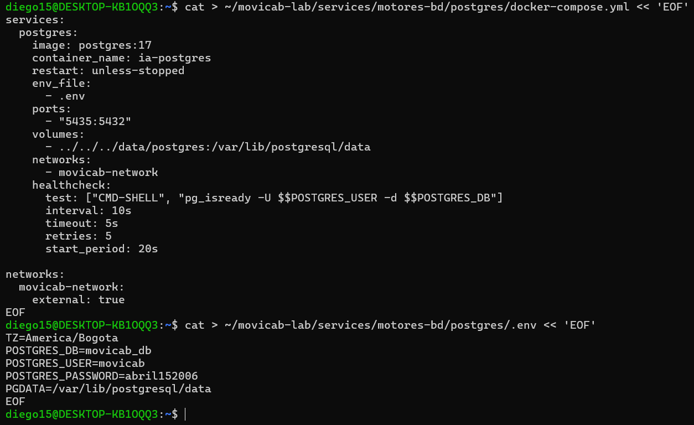

**Descripción:**
Configuración del servicio PostgreSQL 17 con base de datos inicial `movicab_db` y usuario `movicab`, publicado en el puerto 5435.

### 5.3 Verificación del contenido de los archivos

**Comandos ejecutados:**
```bash
cat ~/movicab-lab/services/motores-bd/postgres/docker-compose.yml
cat ~/movicab-lab/services/motores-bd/postgres/.env
```

**Captura:**

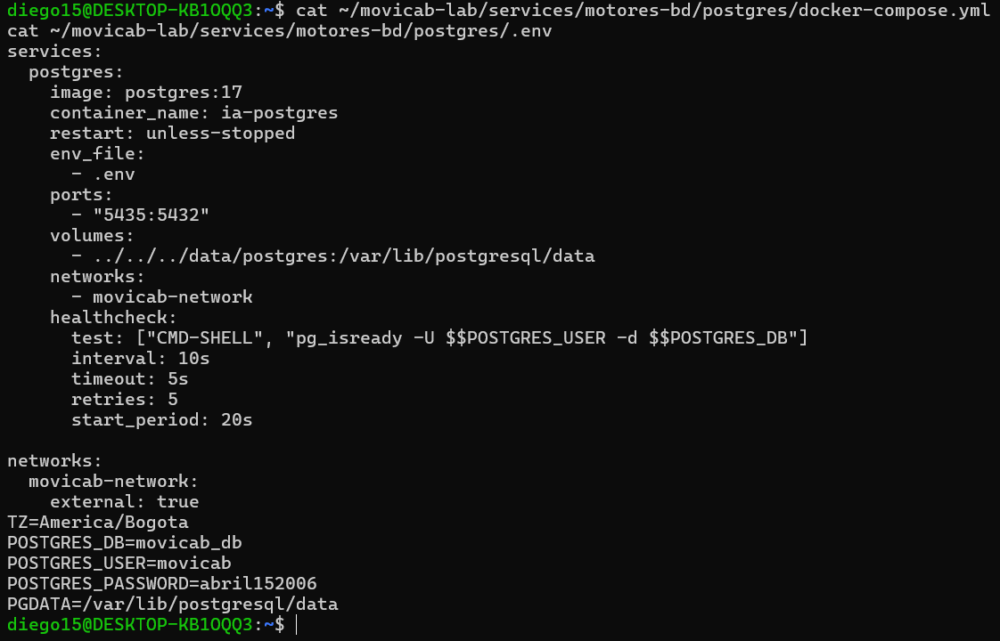

**Descripción:**
Verificación del contenido real de los archivos `docker-compose.yml` y `.env` creados para el motor PostgreSQL.

### 5.4 Levantar el contenedor y verificar

**Comandos ejecutados:**
```bash
cd ~/movicab-lab/services/motores-bd/postgres
docker compose up -d
docker ps | grep ia-postgres
docker logs ia-postgres --tail 20
```

**Captura:**

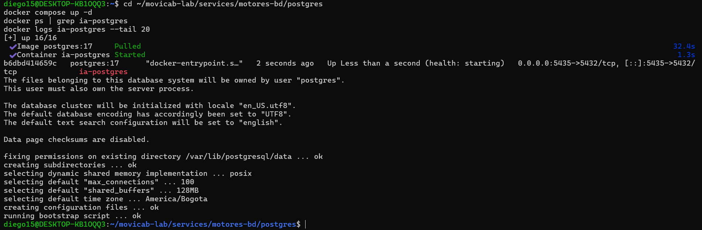

**Descripción:**
Despliegue exitoso del motor PostgreSQL 17 en el puerto 5435, corriendo bajo el nombre de contenedor `ia-postgres`.

> **Nota sobre permisos:** si al listar `~/movicab-lab/data/postgres/` se ve vacía o inaccesible (el contenedor escribe con el UID interno 999), usar `sudo ls -la ~/movicab-lab/data/postgres/` o `sudo chmod -R 755 ~/movicab-lab/data/postgres/`. El contenedor sigue funcionando con normalidad.

### 5.5 Crear el usuario `diego15` con privilegios totales
 
**Comandos ejecutados:**
```bash
docker exec -it ia-postgres psql -U movicab -d movicab_db
```
```sql
DROP USER IF EXISTS diego15;
CREATE USER diego15 WITH PASSWORD 'abril152006';
ALTER USER diego15 WITH SUPERUSER;
\du diego15
```
 
**Captura:**
 
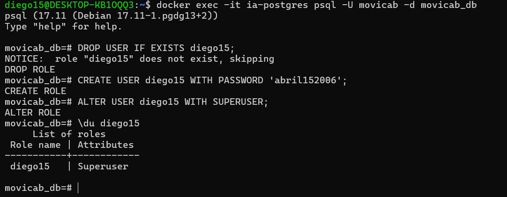
 
**Descripción:**
Creación del usuario `diego15` y otorgamiento de privilegios `SUPERUSER` (privilegios totales) sobre el motor PostgreSQL.

### 5.6 Prueba de conexión desde DBeaver

**Pasos realizados:**
1. Nueva conexión en DBeaver → PostgreSQL
2. Host: `172.21.129.16` — Puerto: `5435` — Base de datos: `movicab_db` — Usuario: `diego15` — Contraseña: `abril152006`
3. Test Connection

**Captura:**

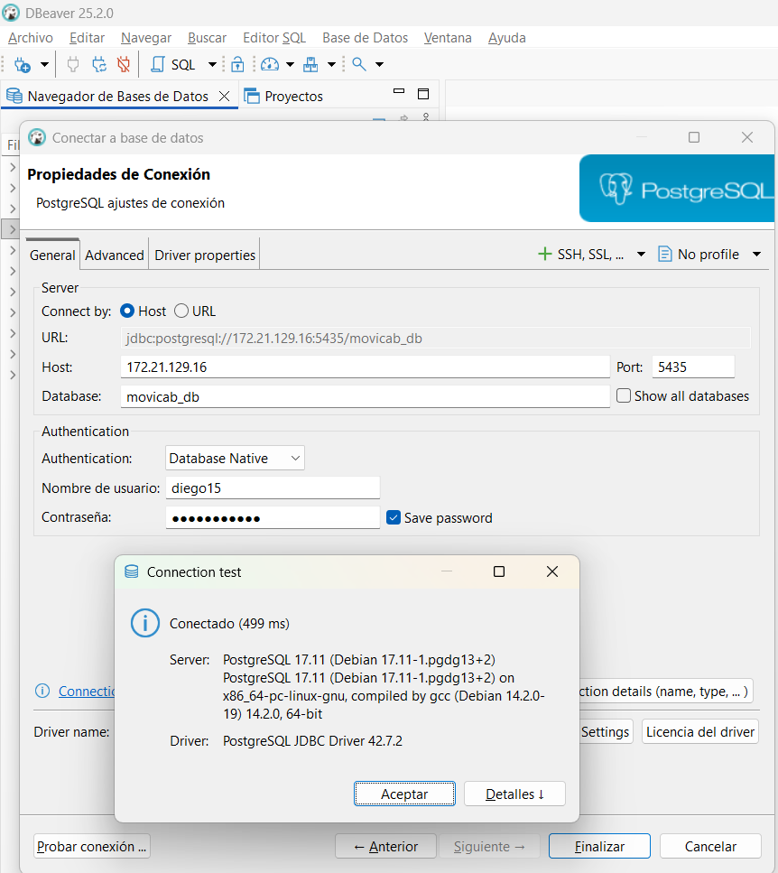

**Descripción:**
Verificación de conexión exitosa al motor PostgreSQL desde el cliente gráfico DBeaver.

---

## 6. SQL Server

### 6.1 Verificación de puertos disponibles

**Comandos ejecutados:**
```bash
docker ps -a --format "table {{.Names}}\t{{.Ports}}" | grep sqlserver
ss -tulpn | grep 1433
```

**Captura:**

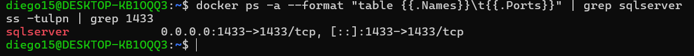

**Descripción:**
Se verificó que el puerto 1433 ya estaba en uso por un contenedor `sqlserver` existente de otro proyecto, por lo que se reasignó el motor de MoviCab al puerto 1434.

### 6.2 Creación de archivos de configuración

**Comandos ejecutados:**
```bash
cat > ~/movicab-lab/services/motores-bd/mssql/docker-compose.yml << 'EOF'
services:
  mssql:
    image: mcr.microsoft.com/mssql/server:2022-latest
    container_name: sqlserver-container
    restart: unless-stopped
    user: root
    env_file:
      - .env
    ports:
      - "1434:1433"
    volumes:
      - ../../../data/mssql:/var/opt/mssql
    networks:
      - movicab-network

networks:
  movicab-network:
    external: true
EOF
```
```bash
cat > ~/movicab-lab/services/motores-bd/mssql/.env << 'EOF'
ACCEPT_EULA=Y
MSSQL_SA_PASSWORD=abril152006
MSSQL_PID=Developer
EOF
```

**Captura:**

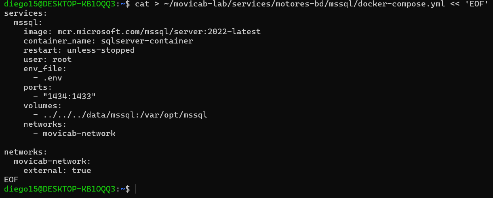

**Descripción:**
Configuración del servicio SQL Server 2022, publicado en el puerto 1434.

### 6.3 Verificación del contenido de los archivos

**Comandos ejecutados:**
```bash
cat ~/movicab-lab/services/motores-bd/mssql/docker-compose.yml
cat ~/movicab-lab/services/motores-bd/mssql/.env
```

**Captura:**

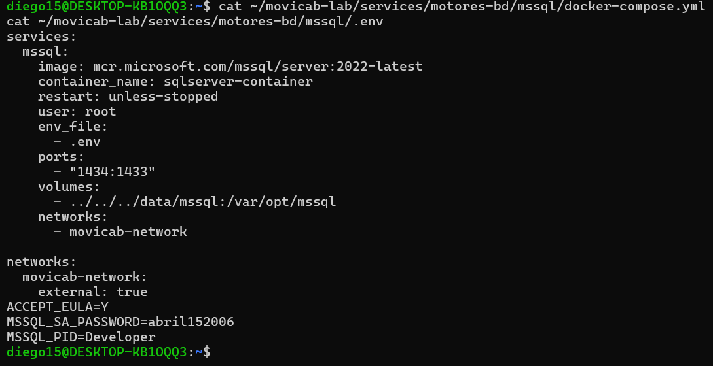

**Descripción:**
Verificación del contenido real de los archivos `docker-compose.yml` y `.env` creados para el motor SQL Server.

### 6.4 Levantar el contenedor y verificar

**Comandos ejecutados:**
```bash
cd ~/movicab-lab/services/motores-bd/mssql
docker compose up -d
docker ps | grep sqlserver-container
docker logs sqlserver-container --tail 20
```

**Captura:**

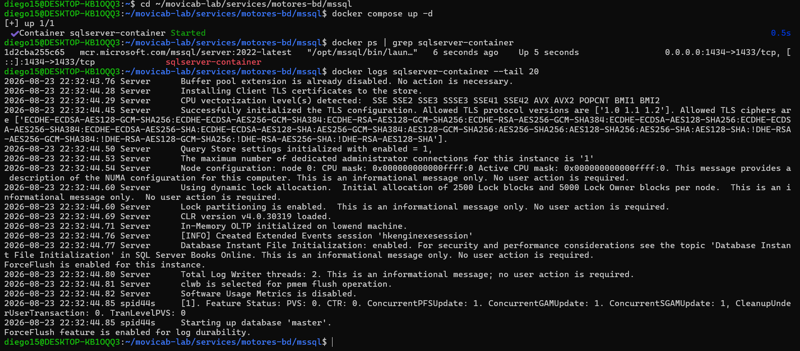

**Descripción:**
Despliegue exitoso del motor SQL Server 2022 en el puerto 1434, corriendo bajo el nombre de contenedor `sqlserver-container`.

### 6.5 Crear el usuario `diego15` con privilegios totales
 
**Comandos ejecutados:**
```bash
docker exec -it sqlserver-container /opt/mssql-tools18/bin/sqlcmd -S localhost -U SA -P 'Abril152006!' -C
```
```sql
CREATE LOGIN diego15 WITH PASSWORD = 'Abril152006!';
GO
ALTER SERVER ROLE sysadmin ADD MEMBER diego15;
GO
SELECT r.name AS rol, m.name AS usuario
FROM sys.server_role_members rm
JOIN sys.server_principals r ON rm.role_principal_id = r.principal_id
JOIN sys.server_principals m ON rm.member_principal_id = m.principal_id
WHERE m.name = 'diego15';
GO
```
 
**Captura:**
 
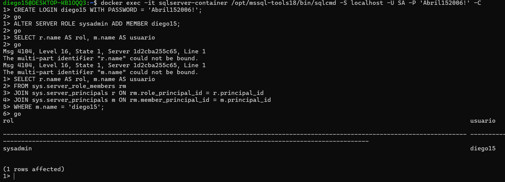
 
**Descripción:**
Creación del login `diego15` y otorgamiento del rol `sysadmin` (privilegios totales) sobre el motor SQL Server.

### 6.6 Prueba de conexión desde DBeaver

**Pasos realizados:**
1. Nueva conexión en DBeaver → SQL Server (Microsoft)
2. Host: `172.21.129.16` — Puerto: `1434` — Usuario: `SA` — Contraseña: `Abril152006!` — Encrypt: `false` / Trust server certificate: activado
3. Test Connection

**Captura:**

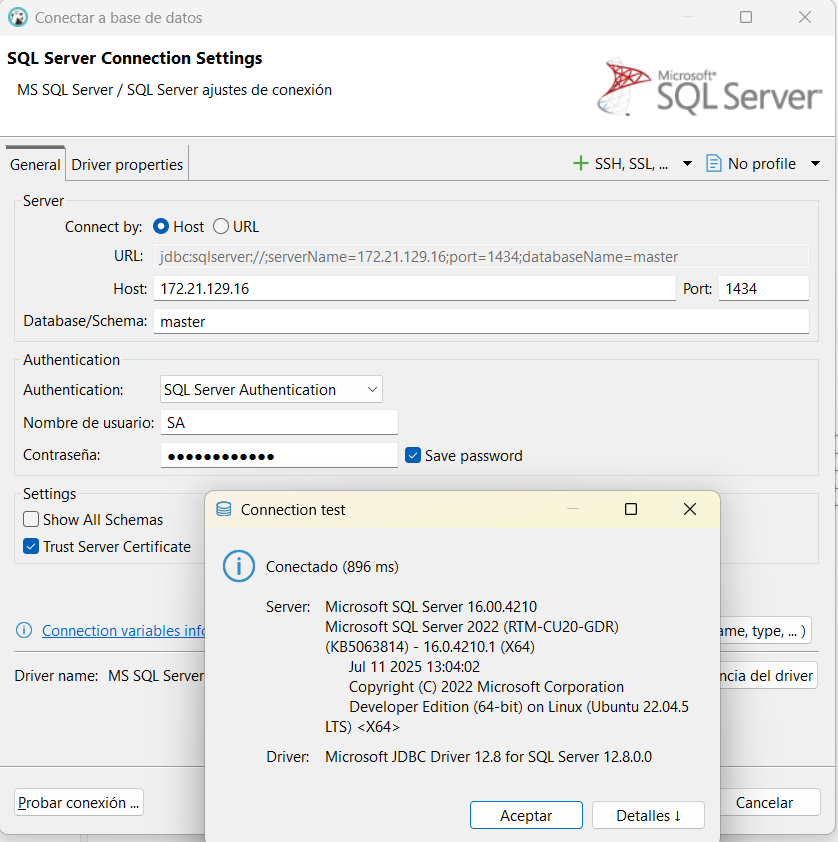

**Descripción:**
Verificación de conexión exitosa al motor SQL Server desde el cliente gráfico DBeaver.

---

## 7. Oracle XE

### 7.1 Verificación de puertos disponibles

**Comandos ejecutados:**
```bash
docker ps -a --format "table {{.Names}}\t{{.Ports}}" | grep oracle
ss -tulpn | grep -E '1521|8080'
```

**Captura:**

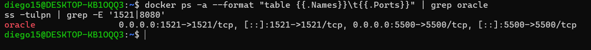

**Descripción:**
Se verificó que el puerto 1521 ya estaba en uso por un contenedor `oracle` existente de otro proyecto, por lo que se reasignaron los puertos del motor de MoviCab a 1522 y 8081.

### 7.2 Creación de archivos de configuración

**Comandos ejecutados:**
```bash
cat > ~/movicab-lab/services/motores-bd/oracle/docker-compose.yml << 'EOF'
services:
  oracle:
    image: gvenzl/oracle-xe
    container_name: oracle-xe
    restart: unless-stopped
    user: root
    env_file:
      - .env
    ports:
      - "1522:1521"
      - "8081:8080"
    volumes:
      - ../../../data/oracle:/opt/oracle/oradata
    networks:
      - movicab-network

networks:
  movicab-network:
    external: true
EOF
```
```bash
cat > ~/movicab-lab/services/motores-bd/oracle/.env << 'EOF'
ORACLE_PASSWORD=abril152006
ORACLE_DATABASE=movicab
EOF
```

**Captura:**

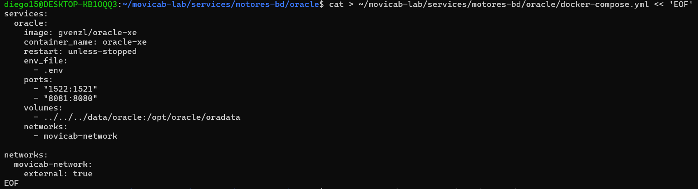
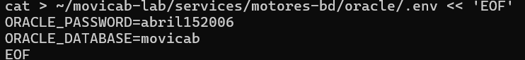

**Descripción:**
Configuración del servicio Oracle XE, publicado en los puertos 1522 (listener) y 8081 (EM Express).

### 7.3 Verificación del contenido de los archivos

**Comandos ejecutados:**
```bash
cat ~/movicab-lab/services/motores-bd/oracle/docker-compose.yml
cat ~/movicab-lab/services/motores-bd/oracle/.env
```

**Captura:**

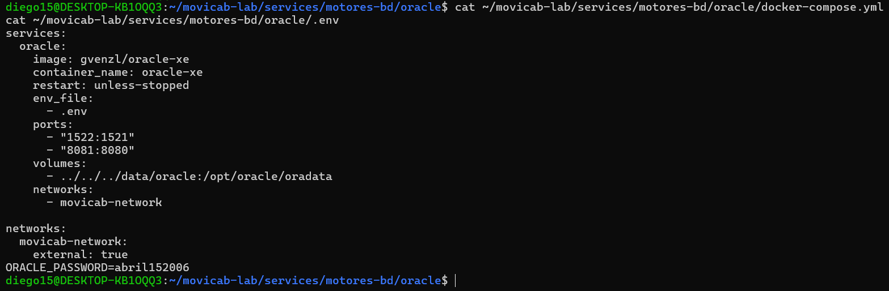

**Descripción:**
Verificación del contenido real de los archivos `docker-compose.yml` y `.env` creados para el motor Oracle.

### 7.4 Levantar el contenedor y verificar

**Comandos ejecutados:**
```bash
cd ~/movicab-lab/services/motores-bd/oracle
docker compose up -d
docker ps | grep oracle-xe
docker logs oracle-xe --tail 20
```

**Captura:**

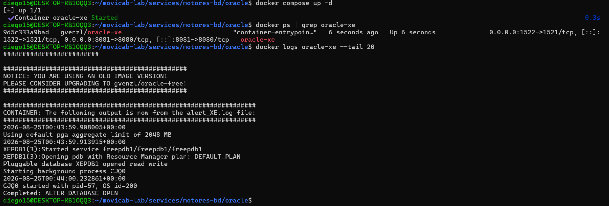

**Descripción:**
Despliegue exitoso del motor Oracle XE en el puerto 1522, corriendo bajo el nombre de contenedor `oracle-xe`. (Nota: Oracle puede tardar 1-2 minutos en completar su inicialización; si el log aún no dice "DATABASE IS READY TO USE!", esperar y volver a revisar.)


### 7.5 Crear el usuario `diego15` con permisos totales sobre su propio esquema

**Comandos ejecutados:**
```bash
docker exec -it oracle-xe sqlplus sys/abril152006 as sysdba
```
```sql
CREATE USER diego15 IDENTIFIED BY "abril152006" DEFAULT TABLESPACE USERS QUOTA UNLIMITED ON USERS;
ALTER USER diego15 QUOTA UNLIMITED ON USERS;
GRANT CONNECT, RESOURCE TO diego15;
```

**Captura:**

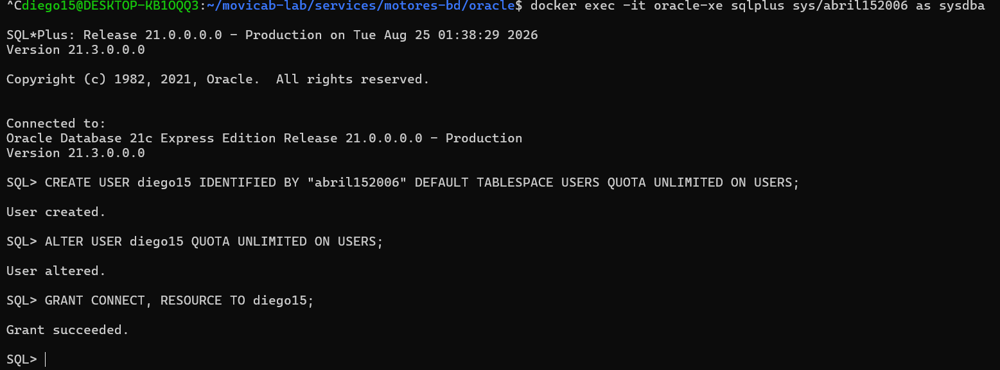

**Descripción:**
Conexión como `SYS` (la sesión queda automáticamente en el PDB `movicab`, configurado como base por defecto del contenedor) y creación del usuario `diego15` con permisos `CONNECT` y `RESOURCE` sobre su propio esquema.

### 7.6 Verificar la creación del usuario

**Comandos ejecutados:**
```sql
SELECT username FROM all_users WHERE username = 'DIEGO15';
```

**Captura:**

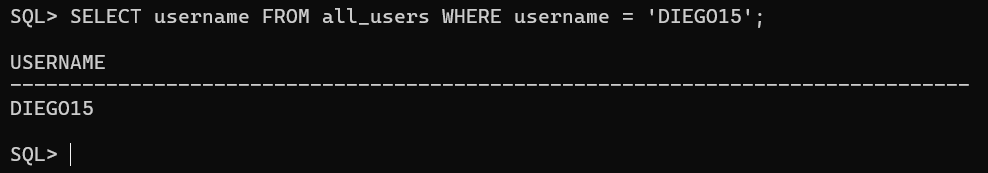

**Descripción:**
Verificación de que el usuario `diego15` quedó creado correctamente en el PDB `movicab`.

### 7.7 Prueba de conexión desde DBeaver

**Pasos realizados:**
1. Nueva conexión en DBeaver → Oracle
2. Host: `172.21.129.16` (de `hostname -I`) — Puerto: `1522` — Service Name: `movicab` — Usuario: `diego15` — Contraseña: `abril152006`
3. Test Connection

**Captura:**

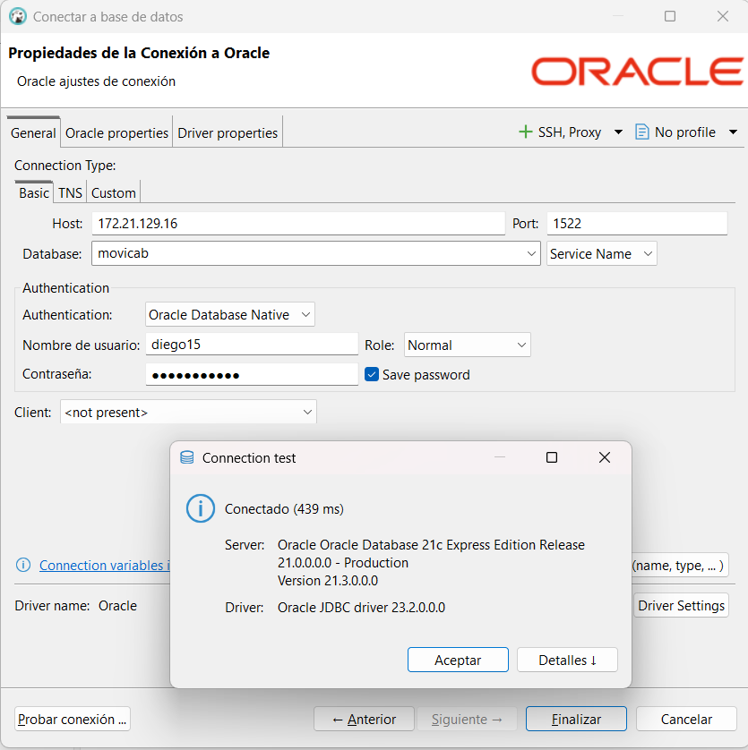

**Descripción:**
Verificación de conexión exitosa al motor Oracle XE desde el cliente gráfico DBeaver, usando el usuario `diego15` y el PDB `movicab`.

---


## Resumen Final de Puertos

| Motor      | Puerto Original (Guía) | Puerto Asignado (MoviCab) | Motivo del cambio |
|------------|:-----------------------:|:---------------------------:|--------------------|
| MySQL      | 3306                    | 3307                        | Puerto ocupado por contenedor `mysql` existente |
| PostgreSQL | 5433                    | 5435                        | Actividad detectada en 5433 sin contenedor asociado visible |
| SQL Server | 1433                    | 1434                        | Puerto ocupado por contenedor `sqlserver` existente |
| Oracle XE  | 1521 / 8080             | 1522 / 8081                 | Puerto 1521 ocupado por contenedor `oracle` existente |

## Resumen Final de Conexiones DBeaver

| Motor      | Host      | Puerto | Base de datos / Service | Usuario   | Contraseña   |
|------------|-----------|:------:|--------------------------|-----------|--------------|
| MySQL      | 172.21.129.16 | 3307   | movicab_db               | diego15   | abril152006  |
| PostgreSQL | 172.21.129.16 | 5435   | movicab_db               | movicab   | abril152006  |
| SQL Server | 172.21.129.16 | 1434   | (default)                | SA        | abril152006  |
| Oracle XE  | 172.21.129.16 | 1522   | XE                       | system    | abril152006  |
