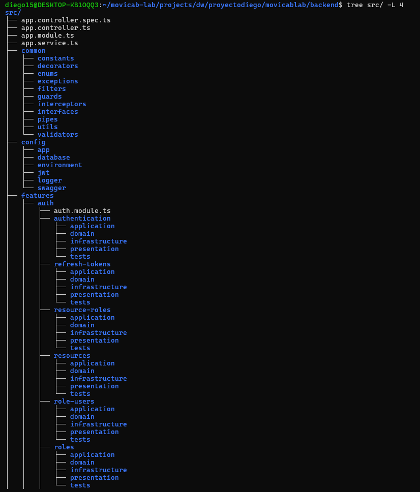
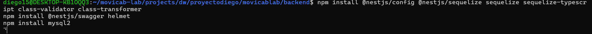
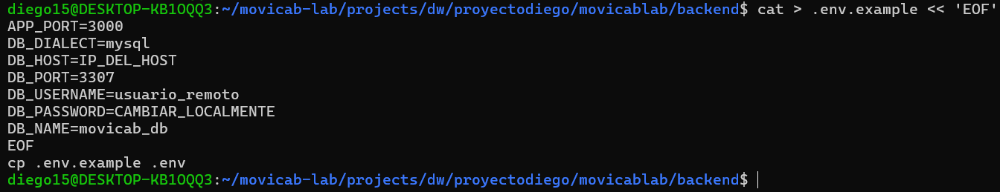
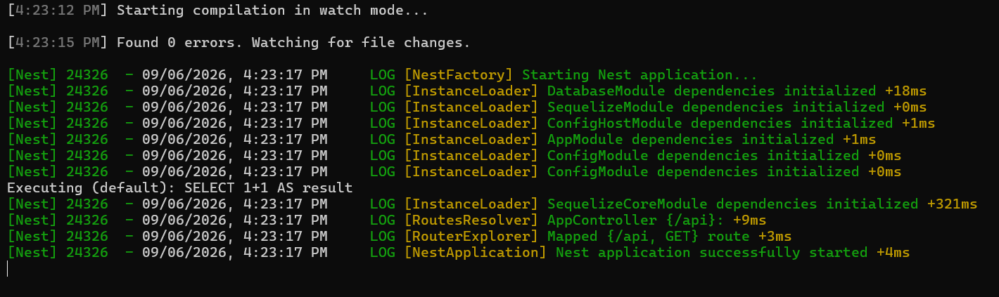
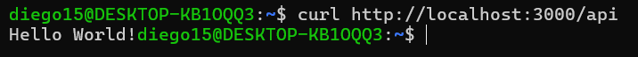
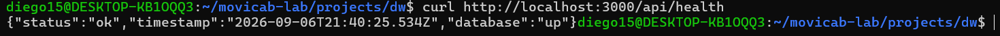
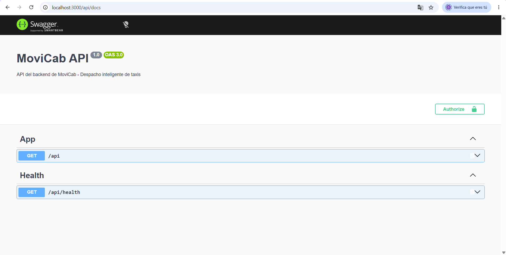

## Instalación de dependencias del backend

**Captura:**

## Primer arranque del backend

**Captura:**

## Prueba con curl

**Captura:**

## Estructura de carpetas por capas (arquitectura)

**Captura:**

## Instalación de dependencias de configuración y BD

**Captura:**

## Variables de entorno (.env.example)

**Captura:**

## Conexión exitosa a MySQL vía Sequelize

**Captura:**

## Prueba con curl (prefijo /api)

**Captura:**

## Health check funcionando

**Captura:**

## Swagger accesible en /api/docs

**Captura:**

