# Bitácora de proceso — MoviCab Backend (pista IA)

**Autor:** Diego Armando De Luque Castillo  
**Proyecto:** MoviCab · Desarrollo Web 2026-II  
**Repositorio:** movicab-lab/backend  
**Metodología:** SDD + Kanban + IA con revisión humana (M4)

> Registra **cada paso** que ejecutes: qué hiciste, qué herramienta usaste, qué verificaste y qué decidió el revisor. El chat de la IA **no** sustituye esta bitácora.

---

## Plantilla de entrada (copiar por cada sesión)

```markdown
### YYYY-MM-DD — ISS-XX — [Estado Kanban]

**Actividad:** (Preparado / En curso / Verificación / Revisión humana / Hecho)

**Qué hice:**
- 

**Prompt IA (si aplica):** trazabilidad/ISS-XX.md §3

**Verificación ejecutada por mí:**
- Comando: 
- Resultado: 

**Commit:** `hash` — `mensaje` — Refs #n

**Revisor:** (pendiente / conforme / devolución / Gate aprobado)

**Notas / aprendizajes:**
- 
```

---

## Registro cronológico

### 2026-09-11 — Día 0 — Preparación metodología

**Actividad:** Preparado (sin issue aún)

**Qué hice:**
- Adapté plantillas de trazabilidad del guion StoreLab a dominio MoviCab (16 entidades, sin auth).
- Creé `docs/Prompt.md`, `docs/kanban.md`, `docs/sdd.md`, `docs/Guion_IA_Desarrollo_Software.md`.
- Definí 12 issues (ISS-01…ISS-12) en lugar de 7, por mayor número de entidades.
- Base de datos elegida: **MySQL** · `movicab_db`.

**Verificación:**
- Estructura Día 0: `.git/`, `docs/`, `trazabilidad/` presentes.
- Pendiente: limpiar `src/`, `node_modules/` del track manual antes de ISS-01.

**Revisor:** pendiente

**Notas:**
- La pista manual y la pista IA comparten dominio MoviCab pero repos/flujo separados.
- WIP = 1: no crear ISS-02 hasta Gate de ISS-01.

---

### (próxima entrada) — ISS-01 — Preparado

**Actividad:** Preparado

**Qué hice:**
- Crear Issue GitHub #1 con título `ISS-01 — Esqueleto NestJS CA arrancable`.
- Completar cabecera en `trazabilidad/ISS-01.md`.
- Enviar a revisor para §2 (aprobación de AC).

**Verificación:** pendiente

**Revisor:** pendiente

---

## Evidencias de motores de BD (Semanas previas)

| Motor | Estado | Notas |
|---|---|---|
| MySQL | OK | Elegido para desarrollo · BD `movicab_db` |
| PostgreSQL | OK | Verificado con Sequelize |
| SQL Server | OK | dialectOptions encrypt |
| Oracle | OK | DUAL, service name |

Detalle en evidencias del repositorio del curso (`dw-2026-DiegoDeluque15`).

---

---

### 2026-09-12 — ISS-01 — Esqueleto NestJS CA arrancable

**Herramienta de IA:** Antigravity (modo agente)

**Prompt usado:** Guion `docs/Guion_IA_Desarrollo_Software.md` ISS-01 + prompt de
corrección con tres puntos explícitos: (1) eliminar `src/features/identity/`, (2) cambiar
PORT a 3000 en `.env.example` y `src/main.ts`, (3) hacer que `GET /api/health` devuelva
el envelope completo `{ statusCode, message, data, timestamp }` definido en Prompt.md §5,
construido manualmente en el controlador.

**Lo que propuso la IA:** Generó el esqueleto completo de NestJS 10 con Clean
Architecture: `package.json` con scripts `free:port` y `start:dev`, `tsconfig.json`,
`nest-cli.json`, `.eslintrc.js`, `.prettierrc`, `.gitignore`, `.env.example` (PORT=3002),
`scripts/free-port.js`, `src/main.ts` con prefijo `/api`, CORS y ValidationPipe,
`AppModule` con `ConfigModule` global, `HealthController` devolviendo solo
`{ "status": "ok" }`, stubs de `src/config/`, `src/common/`,
`src/infrastructure/database/` (sequelize/ y seeders/), `BusinessModule` con los seis
subdirectorios de negocio vacíos, e `IdentityModule` stub.

**Lo que corregí y por qué:**
- **Eliminé `src/features/identity/` completo:** la IA la generó apoyándose en la tabla
  §4.2 de Prompt.md, pero el contrato de la pista prohíbe explícitamente cualquier
  carpeta relacionada con RBAC/Auth bajo cualquier nombre; este issue no debía crearla.
- **Cambié PORT de 3002 a 3000** en `.env.example` y en el fallback de `src/main.ts`:
  la IA tomó 3002 directamente de Prompt.md §5/§8, pero el puerto correcto del proyecto
  es 3000.
- **Corregí `GET /api/health`:** la IA devolvía solo `{ "status": "ok" }`; el contrato
  Prompt.md §5 exige el envelope `{ statusCode, message, data, timestamp }`. Al no
  existir aún el interceptor global (llega en ISS-02), se construyó el envelope
  manualmente dentro del controlador.

**Problemas encontrados y cómo se resolvieron:**
- PowerShell interceptó los operadores `<<`, `&&` y `{…}` al pasar comandos a WSL,
  impidiendo heredocs e inline scripts. Se resolvió escribiendo todos los archivos
  mediante un script Python intermedio guardado en Windows y ejecutado con `wsl python3`.
- Dos ejecuciones de `npm install` se solaparon (la segunda lanzó errores ENOTEMPTY al
  intentar reemplazar paquetes ya escritos por la primera). Se resolvió con
  `rm -rf node_modules && npm install` limpio.

**Resultado / commit:** `pendiente`

**Evidencia (capturas):**
- AC-1 (estructura de carpetas): 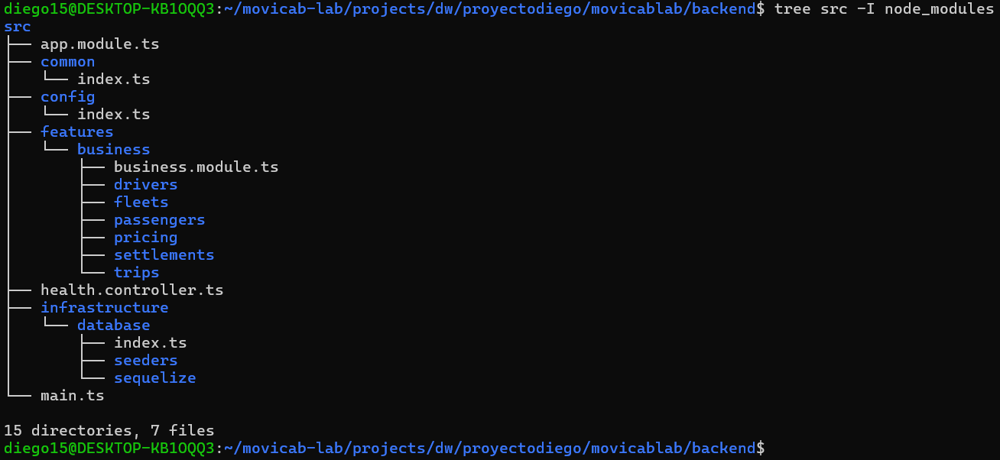
- AC-2 (arranque exitoso): 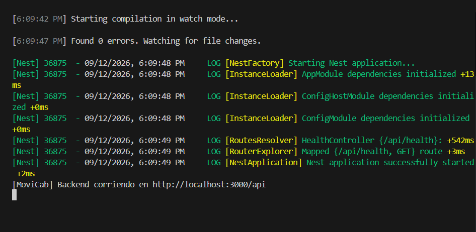
- AC-3 (health check): 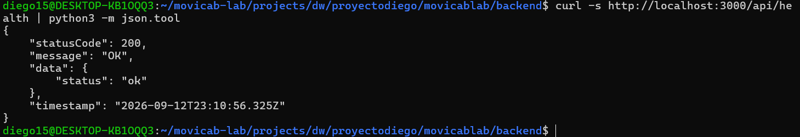
- AC-4 (features/auth no existe): 

---

### 2026-09-12 — ISS-02 — Entorno Sequelize y common

**Herramienta de IA:** Antigravity (modo agente)

**Prompt usado:** Guion `docs/Guion_IA_Desarrollo_Software.md` ISS-02 + prompt inicial
(Implementa AC de `trazabilidad/ISS-02.md` y `docs/Prompt.md` §7-8: validación fail-fast
por `DB_DIALECT`, factory Sequelize multi-motor con `ALL_MODELS=[]`, excepciones comunes,
filtro global, interceptores, `.env.example`) + prompt de corrección sobre
`DB_MYSQL_PASSWORD`: confirmar si el validador permite string vacío o exige no-vacío; si
exige no-vacío, corregir para que las variables `*_PASSWORD` solo requieran que la clave
exista (valor `""` válido), porque MySQL local corre sin contraseña.

**Lo que propuso la IA:** Validación fail-fast en `src/config/environment/` según
`DB_DIALECT`; factory Sequelize multi-motor (`mysql|postgres|mssql|oracle`) con
`ALL_MODELS=[]` y `sync({ alter: false })`; jerarquía de excepciones comunes
(`ApplicationException`, `EntityNotFoundException`, `DomainException`,
`BusinessRuleException`); `GlobalExceptionFilter` con envelope `{ statusCode, message,
error }`; interceptores globales de logging, timeout y response (envelope
`{ statusCode, message, data, timestamp }` con soporte paginado `data.items[] +
data.meta`); `.env.example` actualizado con los cuatro bloques de motor y puertos
remapeados.

**Lo que corregí y por qué:** El validador rechazaba `DB_MYSQL_PASSWORD` vacío con un
`@IsNotEmpty()` implícito (`value.trim() === ''`), lo cual rompía el arranque en MySQL
local sin contraseña. Se corrigió para que las variables `*_PASSWORD` solo exijan que la
clave exista en `process.env` (aceptando valor vacío), mientras el resto de variables
del bloque activo sigue exigiendo no-vacío. Mismo criterio aplicado en
`environment.config.ts` mediante `readExistingEnv()` para contraseñas.

**Problemas encontrados y cómo se resolvieron:** El `.env` local tenía nombres legacy
(`DB_HOST`, `DB_PORT`, etc.) distintos al contrato `DB_MYSQL_*`; se alineó manualmente
con `.env.example`. Tras la corrección de contraseñas vacías, `npm run start:dev` arrancó
y conectó correctamente a MySQL en puerto 3307.

**Resultado / commit:** `pendiente`

**Evidencia (capturas):**
- AC-1 (conexión exitosa): 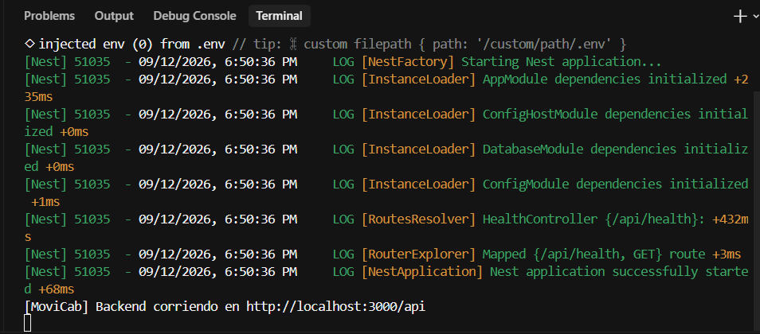
- AC-2a (fail-fast, variable faltante): 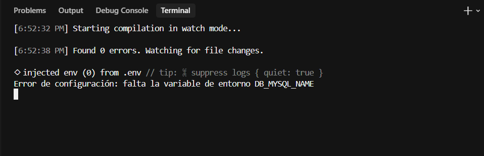
- AC-2b (restaurado, vuelve a arrancar): 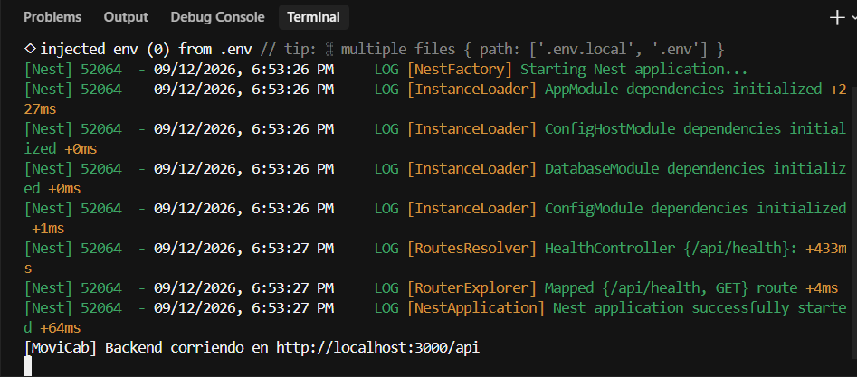
- AC-3 (única sync alter:false): 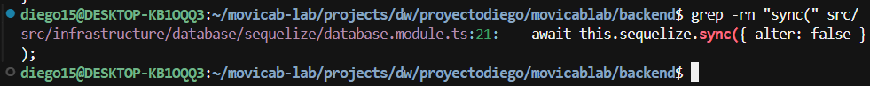
- AC-4 (.env no se commitea): 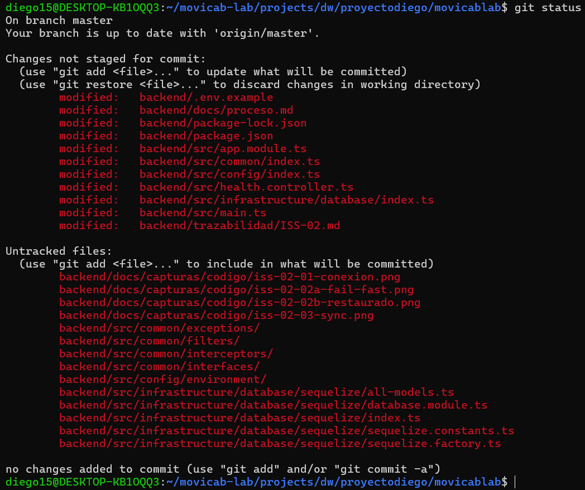

---

### 2026-09-12 — ISS-03 — Feature passengers: Pasajero

**Herramienta de IA:** Antigravity (modo agente)

**Prompt usado:** Guion `docs/Guion_IA_Desarrollo_Software.md` ISS-03 + prompt inicial
(feature `passengers` en cuatro capas CA: entidad pura, `IPasajeroRepository`, CRUD con
paginación, `PasajeroModel` en `ALL_MODELS`, puerto `ICarreraActivaPort` para DELETE 409,
Swagger, registro en `BusinessModule`) + prompts de corrección en la misma sesión: (1)
mantener Swagger aunque estaba planeado para ISS-13; (2) quitar seeder de
`PassengersModule` y eliminar `pasajero.seeder.ts` — la siembra quedará en orquestador
central ISS-13; (3) documentar en código que `StubCarreraActivaAdapter` siempre retorna
false y que el bloqueo DELETE por Carreras no es verificable hasta ISS-09; (4) alinear
todas las referencias de issue de Carrera a **ISS-09** (no ISS-08, que es Tarifa).

**Lo que propuso la IA:** Feature completa en `src/features/business/passengers/` con
entidad pura `Pasajero`, `IPasajeroRepository`, cinco casos de uso (create, list paginado
con filtro `isActive`, getById, update, soft delete), `PasajeroModel` (tabla `pasajeros`)
registrado en `ALL_MODELS`, repositorio Sequelize, `PasajerosController` en
`/api/pasajeros`, puerto `ICarreraActivaPort` con stub, Swagger en `/api/docs`, seeder
idempotente en `onModuleInit`, e integración vía `PassengersModule` → `BusinessModule` →
`AppModule`.

**Lo que corregí y por qué:**
- **Eliminé el seeder del módulo** (`onModuleInit` + `pasajero.seeder.ts`): evitar dos
  mecanismos de siembra compitiendo; ISS-13 definirá orquestador central
  (empresas → conductores → vehiculos → turnos → pasajeros → tarifas).
- **Swagger se mantiene** en `main.ts` y controlador: decisión explícita del autor pese
  a estar planeado originalmente para ISS-13.
- **Comentarios del puerto Carrera unificados en ISS-09:** la IA había referenciado ISS-08
  para la feature Carrera; en el guion ISS-08 es Tarifa y Carrera es ISS-09. Se corrigió
  en `carrera-activa.port.interface.ts`, `stub-carrera-activa.adapter.ts` y
  `delete-pasajero.use-case.ts`, dejando explícito que el stub siempre retorna `false` y
  el 409 por carreras activas no es verificable hasta ISS-09.

**Problemas encontrados y cómo se resolvieron:** `@nestjs/swagger` latest exigía Nest 12;
  se instaló `@nestjs/swagger@^7.4.0` compatible con Nest 10. No hubo otros bloqueos tras
  las correcciones de seeder y numeración de issues.

**Resultado / commit:** `pendiente`

**Evidencia (capturas):**
- AC-1 (POST válido → 201): 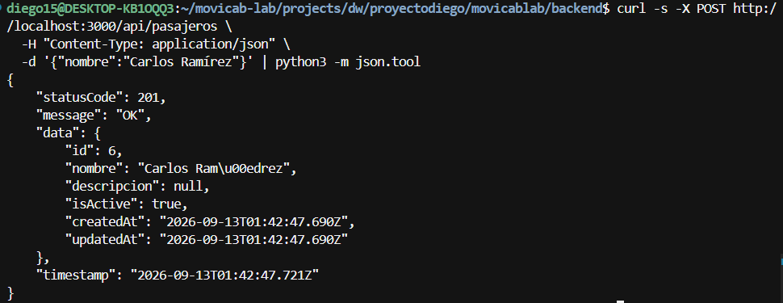
- AC-2 (POST sin nombre → 400): 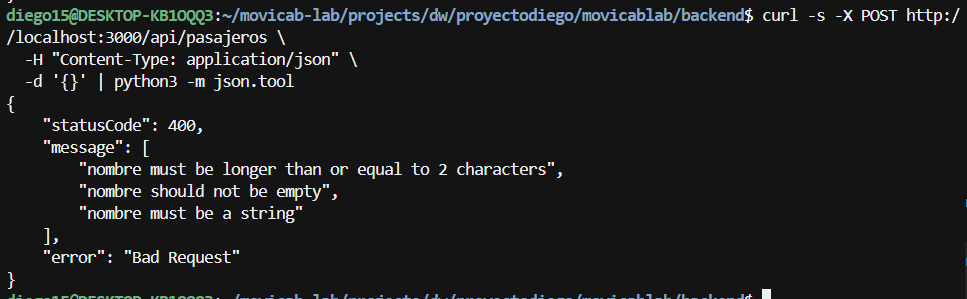
- AC-3 (GET id inexistente → 404): 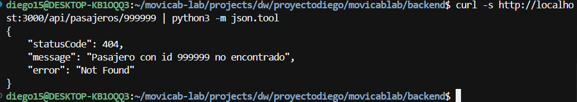
- AC-4 (soft delete, isActive=false): 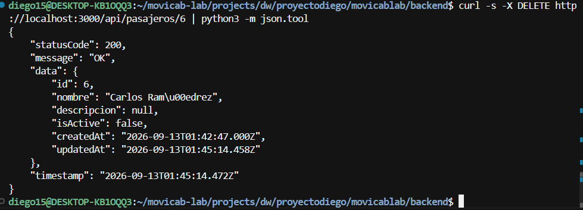

---

### 2026-09-12 — ISS-04 — Feature Empresa CA

**Herramienta de IA:** Antigravity (modo agente)

**Prompt usado:** Guion `docs/Guion_IA_Desarrollo_Software.md` ISS-04 + prompt inicial
(implementar feature Empresa en fleets/empresas/, 4 capas CA, NIT UQ inmutable,
GetEmpresaById, ListEmpresas con stubs ISS-05/ISS-06 para bloqueo DELETE por
conductores/vehículos activos) + prompt de corrección: quitar validación MinLength(3) en
el NIT ya que el contrato solo exige que sea obligatorio y único, no una longitud mínima.

**Lo que propuso la IA:** Feature Empresa completa bajo `src/features/business/fleets/empresas/`
con entidad `Empresa`, repositorios, stubs para Conductores y Vehículos (con referencias
corregidas a ISS-06 e ISS-05 respectivamente), casos de uso de creación y soft-delete con
validación de integridad referencial delegada a los stubs, modelo Sequelize
(`EmpresaModel`), y `EmpresasController`. Todo encapsulado en `FleetsModule` y registrado en
`BusinessModule` y `ALL_MODELS`. El NIT originalmente validaba mínimo 3 caracteres en
entidad y DTO.

**Lo que corregí y por qué:**
- **Removí la restricción de longitud mínima en el NIT:** Se eliminó `@MinLength(3)` del DTO
  y la validación `< 3` en la entidad, dejándolo solo con validación de no-vacío
  (`@IsNotEmpty()`), ya que el contrato de arquitectura (`Prompt.md` e `ISS-04.md`) no
  estipulaba longitud mínima, solo exigía obligatoriedad y unicidad.
- **Se quitaron los timestamps (createdAt/updatedAt) del modelo EmpresaModel**: la
  tabla `empresas` en movicab_db fue creada sin esas columnas, y docs/sdd.md §2.1
  tampoco las define para Empresa (a diferencia de Pasajero). El modelo tenía
  timestamps: true por defecto, causando un error 500 en cualquier consulta porque
  Sequelize intentaba seleccionar columnas inexistentes. Se corrigió a
  timestamps: false y se eliminaron los campos createdAt/updatedAt de las 4 capas
  (modelo, entidad de dominio, mapper de aplicación y mapper de persistencia).

**Problemas encontrados y cómo se resolvieron:**
- Las peticiones POST /api/empresas devolvían 500 Internal Server Error. El log del
  servidor mostró el error dentro de EmpresaRepository.findByNit(), sin mensaje SQL
  detallado. Se diagnosticó comparando el modelo Sequelize contra la estructura real
  de la tabla en MySQL (DESCRIBE empresas): el modelo declaraba timestamps: true pero
  la tabla no tenía las columnas created_at/updated_at. Se resolvió alineando el
  modelo con la tabla real y con el contrato de docs/sdd.md.

**Resultado / commit:** `pendiente`

**Evidencia (capturas):**
- AC-1 (POST válido → 201): 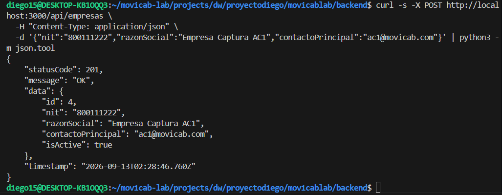
- AC-2 (NIT duplicado → 409): 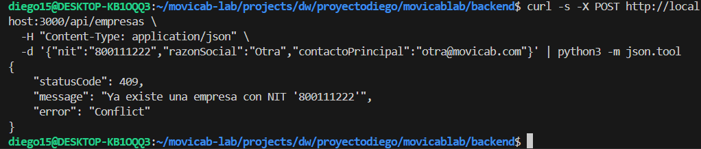
- AC-3 (GET list con conteos): 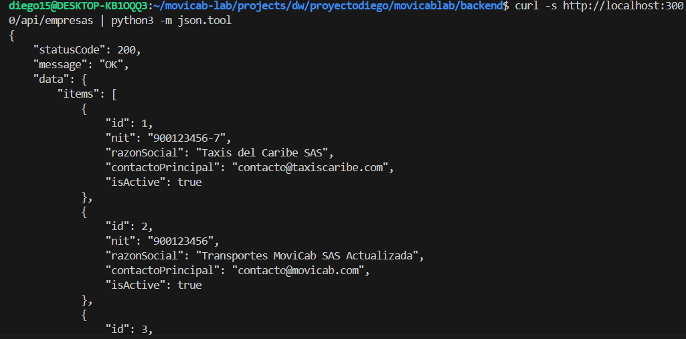
- AC-4 (DELETE con activos → 409, pendiente hasta ISS-05/ISS-06): 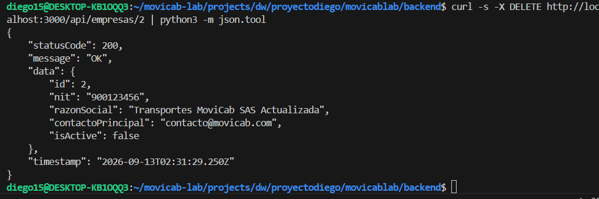

## Reflexión M6 (completar al cierre del gate semanal)

| Pregunta | Respuesta |
|---|---|
| ¿Qué aprendí sobre SDD? | |
| ¿Qué limitaciones tuvo la IA? | |
| ¿Qué corregí manualmente tras generar? | |
| ¿El Kanban reflejó la realidad (WIP=1)? | |

### 2026-09-13 — ISS-05 — Features Conductor y Vehiculo CA
**Herramienta de IA:** Antigravity (modo agente)
**Prompt usado:** Instrucciones detalladas solicitando la lectura del contrato (`Prompt.md`) y ACs (`ISS-05.md`), la creación de la feature Vehiculo (FK obligatoria, timestamps: true) y Conductor (FK opcional, timestamps: true) bajo el patrón CA, prohibición de seeders, y el uso del stub para validar Turnos activos (referenciando correctamente a ISS-06 tras revisar el guion).
**Lo que propuso la IA:** Feature `Vehiculo` completa con FK requerida a `Empresa` activa. Feature `Conductor` completa con FK opcional a `Empresa`. Implementación de un adaptador real (`ConductorActivoAdapter`) que reemplazó el stub en `EmpresasModule` para validar restricciones de eliminación. Todo siguiendo estrictamente la arquitectura de 4 capas CA, inyectando dependencias y registrando en `ALL_MODELS`.
**Lo que corregí y por qué:**
- Se hicieron dos commits separados (Vehiculo y Conductor) sin que el desarrollador lo autorizara explícitamente; se revisaron ambos antes de continuar.
- Tras el segundo commit, aparecieron cambios sin commitear en toda la feature Vehiculo; se verificó con `git diff -w` que eran solo diferencias de fin de línea (CRLF/LF), sin cambios de contenido real, y se descartaron con `git restore`.
**Problemas encontrados y cómo se resolvieron:** Diferencias de fin de línea CRLF/LF entre archivos al ejecutar scripts desde WSL sobre archivos creados en Windows. Resuelto con `git restore` tras confirmar que no había cambios reales.
**Resultado / commit:** `pendiente`

**Evidencia (capturas):**
- AC-1 (Conductor con empresa activa → 201): 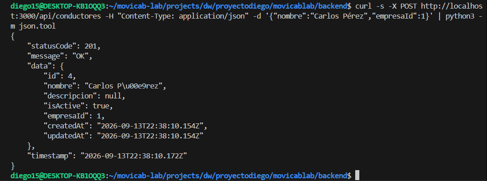
- AC-2 (Vehiculo sin empresa → 400): 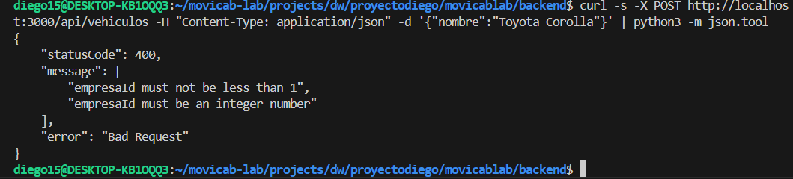
- AC-3 (Vehiculo con empresa inexistente → 404): 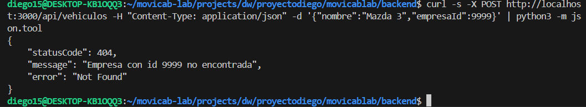
- AC-4 (Vehiculo con empresa inactiva → 409): 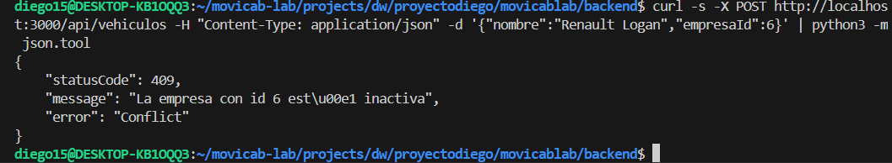

### 2026-09-13 — ISS-06 — Feature Turno CA
**Herramienta de IA:** Gemini 3.1 Pro (High) (modo agente)
**Prompt usado:**
Instrucciones detalladas para leer el contrato arquitectónico y ACs de ISS-06. Implementar feature Turno en `src/features/business/drivers/turnos/` dependiendo de Conductor y Vehiculo (ISS-05).
- Entidad pura `Turno` con dependencias/interfaces asociadas.
- Aplicación: DTOs, casos de uso CRUD, validación de estado activo (404) y solape de turnos simultáneos (409) para conductores y vehículos.
- Infraestructura: `TurnoModel` con `timestamps: true` y FKs, integración en Sequelize.
- Restricciones: prohibición de seeders, y utilizar un stub para `Carrera` verificando el número real de issue en el Guion. Sin commit automático.

**Lo que propuso la IA:** Feature completa de `Turno` con las validaciones exactas de solape, la integración de repositorios correspondientes, y los controladores CRUD. Se construyeron adaptadores reales de turnos activos para inyectarlos cruzadamente en los módulos de Vehiculo y Conductor.
**Lo que corregí y por qué:**
- Se verificó con `grep` que la numeración de ISS-08 (Carrera) era correcta desde el inicio para poder documentar el stub de eliminación de turnos con seguridad.
- Se confirmó con `git diff --stat` que el reemplazo de stubs en `ConductoresModule` y `VehiculosModule` fue mínimo y acotado (solo las inserciones/eliminaciones estrictamente necesarias en los providers y los imports para inyectar los nuevos adaptadores de TurnosModule).
**Problemas encontrados y cómo se resolvieron:** Rutas relativas erróneas en los imports a través de múltiples subdirectorios inter-módulos (`business` > `drivers` > `fleets`); resuelto en masa mediante un script de Node para reemplazar las referencias defectuosas y luego validando con `tsc`.
**Resultado / commit:** `pendiente`

**Evidencia (capturas):**
- AC-1 (crear turno válido → 201): 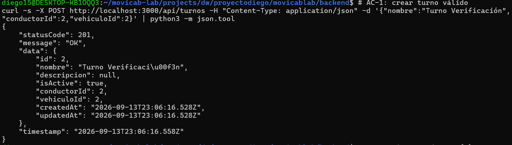
- AC-2 (solape de conductor/vehículo → 409): 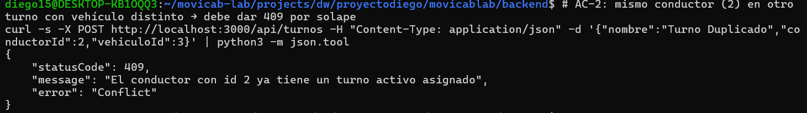
- AC-3 (conductor inexistente → 404): 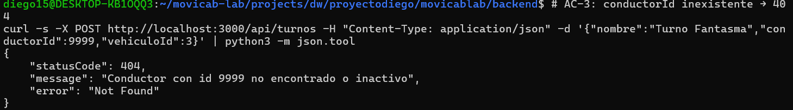
- AC-4 (filtro por conductorId): 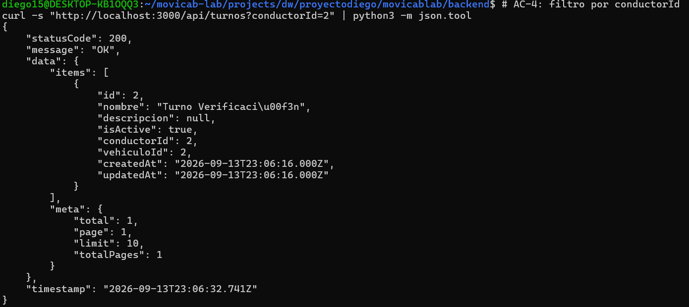

### 2026-09-13 — ISS-07 — Feature Tarifa CA
**Herramienta de IA:** Antigravity (modo agente)
**Prompt usado:**
Instrucciones para implementar la feature Tarifa en `src/features/business/pricing/` siguiendo la Clean Architecture de 4 capas.
- Entidad `Tarifa` sin timestamps.
- DTOs con validaciones lógicas (`valorBase > 0`, fechas coherentes).
- Casos de uso: `CreateTarifa` (valida solape), `GetTarifaVigente`, `UpdateTarifa` (solo antes de iniciar vigencia).
- Modelo Sequelize (`timestamps: false`) y controlador con `GET /api/tarifas/vigente` priorizado.
- Restricciones: sin seeders, stub de Carrera (ISS-08) para validación de delete.

**Lo que propuso la IA:** Feature `Tarifa` completa con todas las validaciones de negocio exigidas. Se generó el endpoint vigente registrado correctamente antes que las rutas paramétricas, y el stub de eliminación apuntando a ISS-08.
**Lo que corregí y por qué:**
- Se corrigió el código HTTP devuelto al enviar fechas de vigencia invertidas (`vigenciaDesde >= vigenciaHasta`). Originalmente se lanzaba una excepción de negocio (`BusinessRuleException` -> 409), pero siendo un error de validación lógica de entrada, se modificó para lanzar una `DomainException` (400 Bad Request).
**Problemas encontrados y cómo se resolvieron:** Paths de importación hacia la carpeta `common` desde subdirectorios anidados con un nivel extra; solucionado masivamente mediante un script de Node antes de compilar.
**Resultado / commit:** `pendiente`

**Evidencia (capturas):**
- AC-1 (crear tarifa válida → 201): 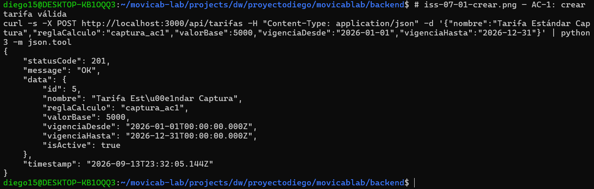
- AC-2 (valorBase <= 0 → 400): 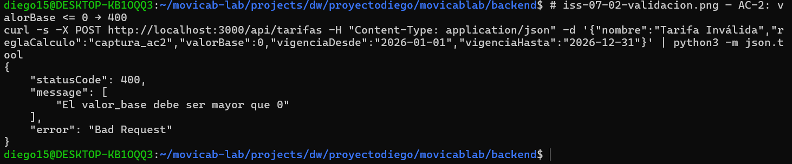
- AC-3 (solape de vigencia → 409): 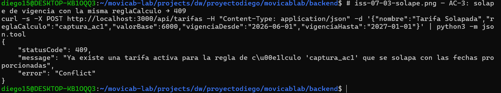
- AC-4 (GET /vigente → 200): 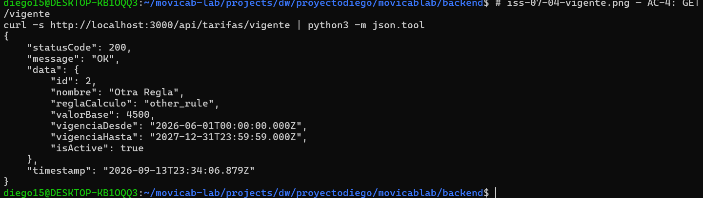

### 2026-09-13 — ISS-08 — Feature Carrera CA
**Herramienta de IA:** Antigravity (modo agente)
**Prompt usado:**
Instrucciones para leer el contrato arquitectónico (`Prompt.md`) y `trazabilidad/ISS-08.md`
antes de escribir código. Implementar la feature Carrera en `src/features/business/trips/`
siguiendo la Clean Architecture de 4 capas:
- Domain: entidad `Carrera` (sin `createdAt`/`updatedAt`) con método `cambiarEstado()`
  encapsulando la máquina de estados (solicitada→aceptada→en_curso→cerrada / cancelada);
  lanza `EstadoInvalidoException` (409) en transiciones inválidas. `ICarreraRepository`,
  `CarreraNotFoundException`.
- Application: `CreateCarreraDto` (solo `pasajeroId`, `turnoId`, `observaciones?`);
  `CreateCarreraUseCase` (valida Pasajero activo, Turno activo, Tarifa vigente);
  `CambiarEstadoCarreraUseCase` (al cerrar fija `fechaFin` y calcula `total = tarifa.valorBase`
  en servidor). Casos de uso List y GetById. `ChangeEstadoCarreraDto`.
- Infrastructure: `CarreraModel` (`timestamps: false`, registrado en `ALL_MODELS`); repositorio;
  adapters reales `CarreraActivaPasajeroAdapter`, `CarreraActivaTurnoAdapter`,
  `CarreraActivaTarifaAdapter` que reemplazan los stubs de ISS-03/06/07 consultando
  `CarreraModel` filtrando por `pasajeroId`/`turnoId`/`tarifaId`.
- Presentation: `CarrerasController` (POST, GET, PATCH /estado); `DespachosController`
  (POST /api/despachos/:id alias de despachar a `aceptada`).
Restricciones: sin seeders, sin commit automático, `liquidacionId` queda nullable.

**Lo que propuso la IA:** Feature completa con todos los casos de uso, máquina de
estados en la entidad, `total` calculado server-side, tres adapters reales conectados
a `CarreraModel`, `TripsModule` registrado en `BusinessModule`, y `forwardRef` donde
hubiera dependencia circular con Pasajeros/Turnos/Tarifas.

**Lo que corregí y por qué:**
- **Los 3 stubs no habían sido reemplazados en el primer reporte:**
  `StubCarreraActivaAdapter` en Pasajero y Turno, y `StubCarreraActivaTarifaAdapter`
  en Tarifa, seguían activos y sus archivos `.ts` existían en disco. Se completó el
  reemplazo por los adapters reales `CarreraActiva*Adapter` en los módulos
  correspondientes y se eliminaron los 3 ficheros stub.
- **Referencia incorrecta ISS-09 → ISS-08:** el comentario en
  `passengers/application/use-cases/delete-pasajero.use-case.ts` decía "ISS-09"
  para referirse a la feature Carrera; corregido a "ISS-08" (número real en el Guion),
  junto con los JSDoc de las 3 interfaces de puerto afectadas.
- **Confirmación de `forbidNonWhitelisted`:** se probó enviando `total` en el body de
  `POST /api/carreras` → el `ValidationPipe` global rechazó con 400 ("property total
  should not exist"). Sin cambios necesarios.
- **Confirmación de ruta de despachos:** se decidió mantener `POST /api/despachos/:id`
  (id en la URL) en vez del body; es la opción más RESTful para el alias de despacho.

**Problemas encontrados y cómo se resolvieron:**
- Rutas relativas a `common/` con un nivel de anidamiento incorrecto desde `trips/`
  (se generaron con `../../../../common/` cuando debían ser `../../../../../common/`).
  Resuelto con un script Node que recalcula el prefijo correcto basándose en la
  profundidad relativa desde `src/` y reemplaza en masa.
- Error de inyección en tiempo de ejecución: `CreateCarreraUseCase` inyectaba use-cases
  cross-module (`GetPasajeroByIdUseCase`, etc.) en vez de repositorios; corregido para
  inyectar directamente `IPasajeroRepository`, `ITurnoRepository`, `ITarifaRepository`
  vía sus tokens `Symbol`, eliminando la dependencia de use-cases ajenos.
- Nombre de método incorrecto en `CarreraActivaPasajeroAdapter`: implementaba
  `hasActiveCarreras()` pero el puerto `ICarreraActivaPort` exige
  `hasBlockingCarrerasForPasajero()`; corregido.

**Resultado / commit:** `pendiente`

**Evidencia (capturas):**
- AC-1 (crear carrera válida → 201, solicitada): 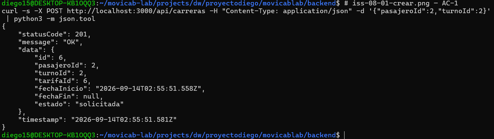
- AC-2 (turno inexistente → 404): 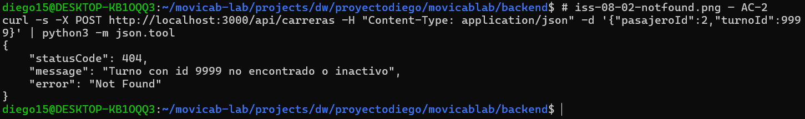
- AC-3 (transición inválida → 409): 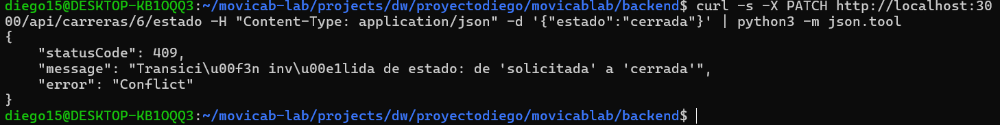
- AC-4 (cerrada con total calculado): 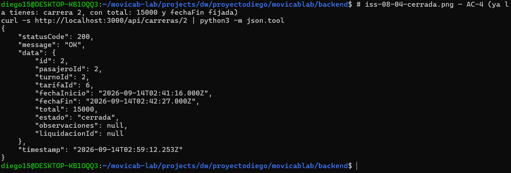
- Extra (DELETE bloqueado en carrera cerrada → 409): 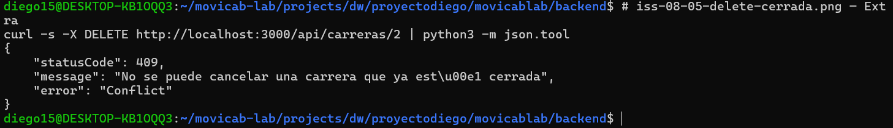
- Extra (cancelación válida desde solicitada → 200): 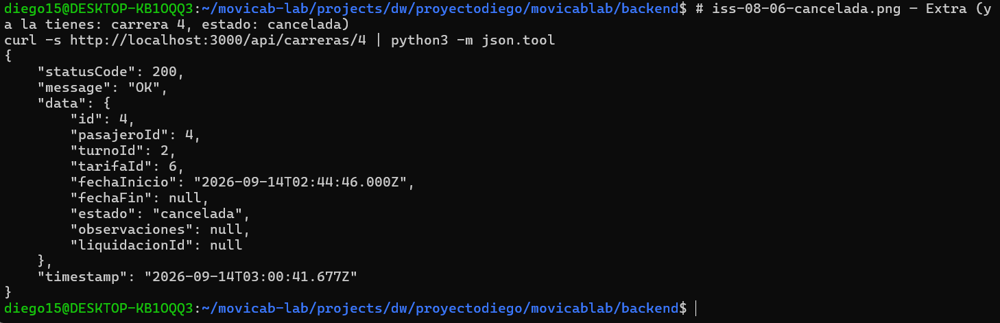
- Extra (POST /despachos/:id funcional): 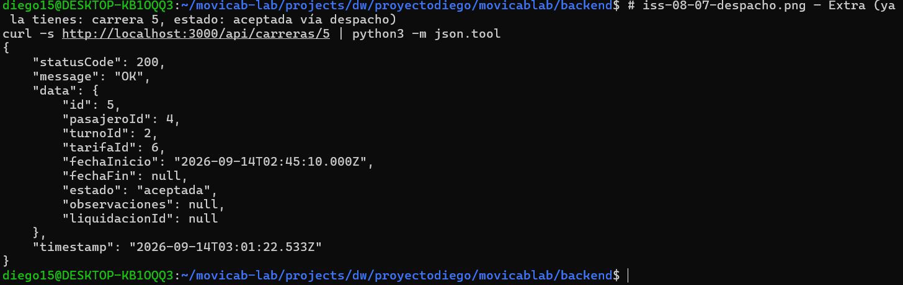
- Extra (integración: bloqueo real en Pasajero/Turno/Tarifa): 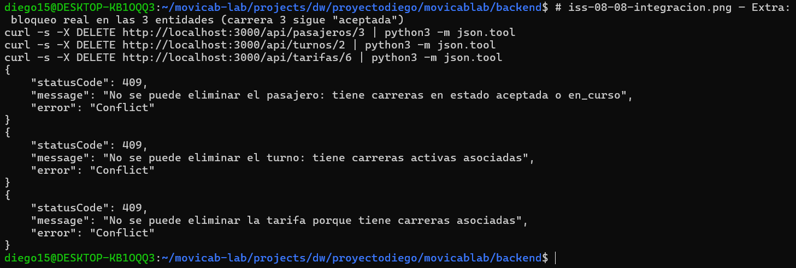


### 2026-09-14 — ISS-09 — Features Pago y Calificacion CA
**Herramienta de IA:** Antigravity (modo agente)
**Prompt usado:**
(Ver `trazabilidad/ISS-09.md` sección "IA usada")

**Lo que propuso la IA:** Feature `Pago` y `Calificacion` completas con entidades puras, repositorios Sequelize y controladores, registradas en `SettlementsModule`.
**Lo que corregí y por qué:**
1. Confirmación previa a implementar: los campos de Calificacion no estaban definidos con sentido semántico en docs/Prompt.md (solo nombre/descripcion genéricos); se decidió usar carreraId, puntaje (1-5), comentario, isActive, y se documentó esa decisión como nota en Prompt.md.
2. Build inicial con 26 errores: la implementación usó @nestjs/sequelize (SequelizeModule, InjectModel), un paquete no instalado y un patrón distinto al resto del proyecto (sequelize-typescript con factory manual). Corregido para seguir el patrón consistente de TripsModule. También había rutas relativas rotas hacia trips/.
3. Tras corregir el build, el servidor se caía al arrancar con un error real de MySQL (ER_KEY_COLUMN_DOES_NOT_EXITS) al crear el índice único de Calificacion: el modelo no tenía underscored: true, causando un desajuste entre el nombre de columna en TypeScript (carreraId) y en la base de datos real (carrera_id). Corregido agregando underscored: true y definiendo la unicidad a nivel de columna con field: 'carrera_id'.
4. Las respuestas de POST /api/pagos y POST /api/calificaciones tenían el envelope de éxito duplicado (el controller construía uno manual además del interceptor global). Corregido para que los controllers retornen el objeto plano.
5. La ruta de actualización de estado de Pago no coincidía con el contrato (PATCH /api/pagos/:id en vez de PATCH /api/pagos/:id/estado). Corregida.
6. Los PATCH de Pago y Calificacion devolvían data: null pese a que el update sí se aplicaba correctamente en la base de datos (confirmado con GET posterior). Corregido para que ambos devuelvan la entidad completa actualizada.

**Problemas encontrados y cómo se resolvieron:**
Esta fue la sesión con más iteraciones de corrección hasta ahora. Cada corrección fue verificada con peticiones `curl` reales contra el servidor local antes de darla por aceptada, garantizando así su correcto funcionamiento más allá de la compilación exitosa (ej. validación del whitelist, estructura del DTO, y estado de la base de datos).

**Resultado / commit:** `pendiente`

**Evidencia (capturas):**
- AC-1 (pago creado con monto automático → 201): 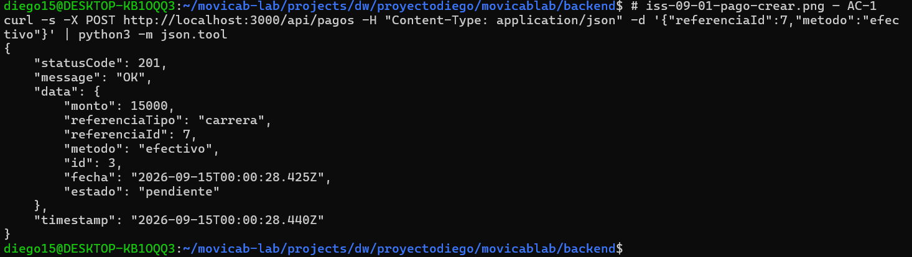
- AC-2/interpretación (pago sobre carrera no cerrada → 409): 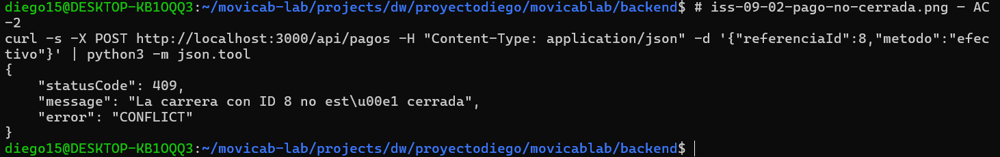
- AC-3 (calificación duplicada → 409): 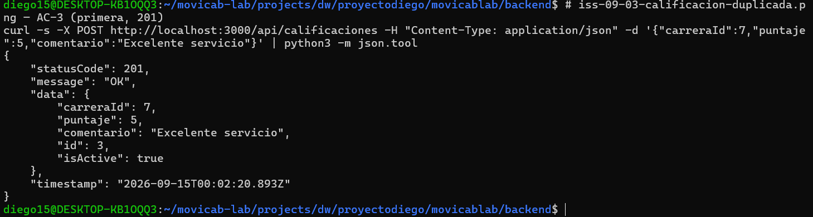
- AC-4 (calificación sobre carrera no cerrada → 409): 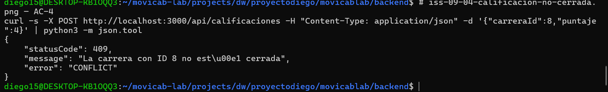
- Extra (validación de rango de puntaje → 400): 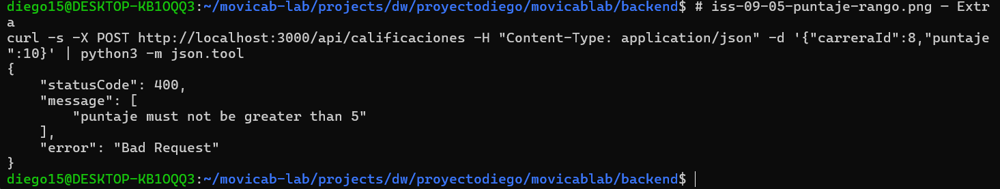

### ISS-10: Liquidacion (Feature)

**Herramienta / modelo:** Antigravity (modo agente)

**Lo que me pidieron:**
Implementar la feature Liquidacion (Domain, Application, Infrastructure, Presentation) para agrupar las carreras cerradas en una transacción, y validar su flujo de negocio.

**Lo que analicé:**
- La agrupación de carreras requiere que sea dentro de una transacción para mantener la consistencia (todas se asignan o ninguna).
- El diseño requería que la Liquidación sea inmutable respecto al `valor`.

**Lo que corregí:**
1. La decisión de restaurar la agrupación por conductorId (con la nota agregada en docs/Prompt.md), ya que ni Prompt.md ni ISS-10.md especificaban agrupar por conductor/empresa originalmente.
2. La inconsistencia de tipo en "valor" (number en creación, string "45000.00" en lecturas posteriores por ser DECIMAL en MySQL); corregido con un getter Number() en el modelo Sequelize, manteniendo DECIMAL(12,2) en la base de datos.
3. Confirmación (sin cambios necesarios) de que forbidNonWhitelisted ya protege "valor" de modificaciones vía PATCH.
4. Confirmación de que doble anulación y transición inválida por PATCH (anulada vía PATCH en vez del endpoint dedicado) ya estaban correctamente bloqueadas desde la implementación inicial.

**Resultado / commit:** `pendiente`

**Evidencia (capturas):**
- AC-1 (crear liquidación con valor sumado → 201): 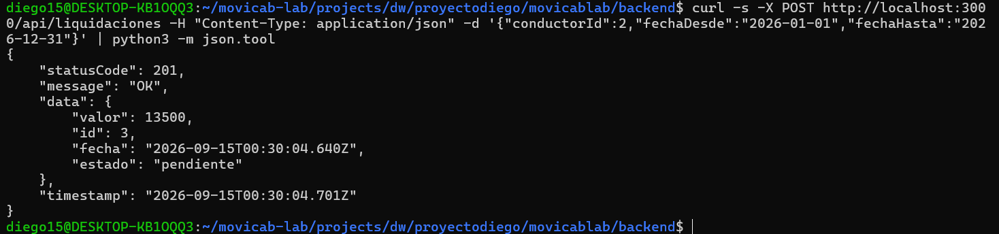
- AC-2 (GET con carreras agrupadas, valor tipo number): 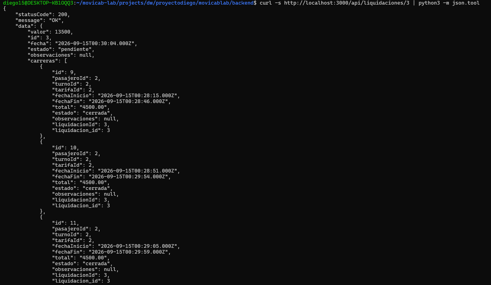
- AC-3 (segunda solicitud mismo rango → 409, excluye liquidadas): 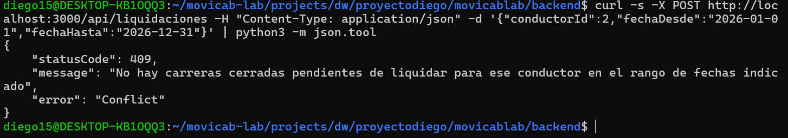
- AC-4 (anular libera liquidacionId de las carreras): 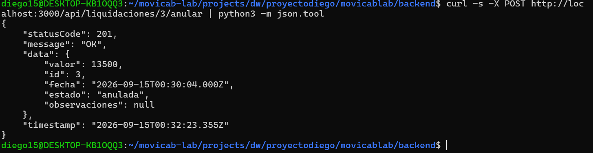
