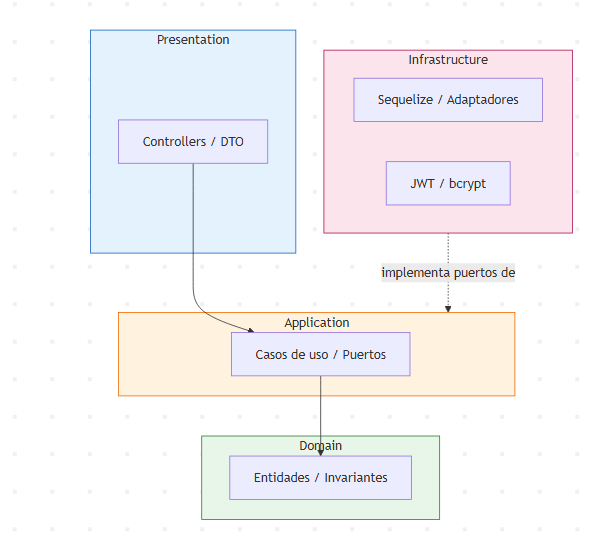

# SDD — MoviCab (estudiante-proyecto9)

**Asignatura:** Desarrollo Web · 2026-II
**Semana:** 04 · Fundamentos web, dominio y arquitectura
**Proyecto:** 09. MoviCab - Despacho inteligente de taxis
**Autor:** Diego Armando De Luque Castillo (GitHub: DiegoDeluque15)

---

## M1 — Alineación

| Elemento | Decisión |
|---|---|
| Objetivo | Construir y explicar una rebanada vertical funcional del backend de MoviCab. |
| Entidades | Pasajero, Conductor, Empresa, Vehiculo, Turno, Tarifa, Carrera, Pago, Calificacion, Liquidacion, User, Role, RoleUser, Resource, ResourceRole, RefreshToken. |
| M2 | Campos, invariantes, relaciones, casos de uso, REQ, AC, errores, permisos y contratos (este documento). |
| M3 | Issues dependientes, WIP=1, DoR, DoD, pruebas previstas (docs/kanban.md). |
| M4 | IA autorizada solo como apoyo; toda salida se revisa, adapta y registra (docs/proceso.md). |
| M5 | Pruebas de dominio, aplicación, adaptadores, API, integración y seguridad. |
| M6 | Gate, evidencias y reflexión. |

## 1. Problema, actores y requisitos del dominio

### 1.1 Problema

MoviCab necesita despachar viajes de forma automática: recibir solicitudes de pasajeros, ubicar conductores disponibles según turno y vehículo activos, controlar el ciclo de vida completo de la carrera (solicitada → aceptada → en curso → cerrada), calcular la tarifa aplicando reglas vigentes sin que el conductor pueda alterar parámetros protegidos (tarifa base, recargos), registrar el pago y la calificación, y finalmente liquidar periódicamente a conductores o empresas afiliadas agrupando sus carreras cerradas.

### 1.2 Actores

| Actor | Rol RBAC | Interacción principal |
|---|---|---|
| Pasajero | (sin rol de sistema — es dato de negocio, no usuario autenticado) | Solicita carreras, califica al finalizar. |
| Conductor | CONDUCTOR | Recibe despachos, ejecuta carreras, ve su historial y liquidaciones. |
| Despachador | DESPACHO | Asigna/gestiona el despacho de carreras a conductores disponibles. |
| Administrador | ADMIN | Gestiona tarifas, empresas, conductores, vehículos; acceso total. |
| Finanzas | FINANZAS | Gestiona pagos y liquidaciones. |
| Soporte | SOPORTE | Consulta y resuelve incidencias de carreras y pagos. |

*Nota: el Pasajero es una entidad de negocio (no requiere login para el alcance de esta semana); los actores con acceso al backend son los usuarios internos (Conductor, Despacho, Admin, Finanzas, Soporte).*

### 1.3 Requisitos (alcance Semana 04)

| ID | Requisito |
|---|---|
| REQ-S04-01 | Problema, actores y requisitos documentados (este archivo). |
| REQ-S04-02 | Modelo de dominio con entidades y relaciones definido y diagramado. |
| REQ-S04-03 | Arquitectura por capas definida (presentation/application/domain/infrastructure). |
| REQ-S04-04 | Contratos (DTO/API) iniciales definidos. |
| REQ-S04-05 | Base del backend NestJS operativa: config, common, database, logging, health, Swagger. |
| REQ-S04-06 | docs/sdd.md y docs/kanban.md actualizados con trazabilidad. |

## 2. Modelo de dominio

### 2.1 Entidades de negocio

| Entidad | Atributos clave | Invariantes |
|---|---|---|
| Pasajero | id, nombre, descripcion, is_active, created_at, updated_at | Nombre obligatorio. |
| Empresa | id, nit (UQ), razon_social, contacto_principal, is_active | NIT único. |
| Conductor | id, nombre, descripcion, is_active, created_at, updated_at | Debe pertenecer a una Empresa activa o ser independiente. |
| Vehiculo | id, nombre, descripcion, is_active, created_at, updated_at | Debe pertenecer a una Empresa activa. |
| Turno | id, nombre, descripcion, is_active, created_at, updated_at | Requiere Conductor y Vehiculo activos. |
| Tarifa | id, nombre, regla_calculo, valor_base, vigencia_desde, vigencia_hasta, is_active | valor_base > 0; vigencia_desde < vigencia_hasta; el conductor NO puede modificarla. |

### 2.2 Entidades de venta/operación

| Entidad | Atributos clave | Invariantes |
|---|---|---|
| Carrera | id, referencia_id (FK Turno), fecha_inicio, fecha_fin, total, estado, observaciones, liquidacion_id (FK nullable) | Estado ∈ {solicitada, aceptada, en_curso, cerrada, cancelada}; total calculado por servidor con la Tarifa vigente; fecha_fin ≥ fecha_inicio. |
| Pago | id, referencia_tipo, referencia_id, metodo, monto, fecha, estado | referencia polimórfica — en el alcance actual, referencia_tipo = 'carrera'; monto > 0; monto = Carrera.total. |
| Calificacion | id, nombre, descripcion, is_active, created_at, updated_at | 0..1 por Carrera; solo tras carrera cerrada. |
| Liquidacion | id, fecha, valor, estado, observaciones | Agrupa 1:N Carreras cerradas (ver Carrera.liquidacion_id); valor = suma de Carrera.total agrupadas. |

### 2.3 Identidad y autorización (RBAC)

| Entidad | Atributos clave | Invariantes |
|---|---|---|
| User | id, email (UQ), password_hash, is_active | Email único; nunca se devuelve el hash. |
| Role | id, nombre (ADMIN, DESPACHO, CONDUCTOR, FINANZAS, SOPORTE), is_active | Nombres fijos del catálogo RBAC. |
| RoleUser | id, user_id (FK), role_id (FK), is_active | Asociación única y activa por (user_id, role_id). |
| Resource | id, nombre (ej. POST /carreras, POST /despachos), is_active | Recursos = endpoints protegidos. |
| ResourceRole | id, resource_id (FK), role_id (FK), is_active | Solo una cadena activa concede permiso. |
| RefreshToken | id, user_id (FK), token_hash, expires_at, revoked | Token expirado o revocado no sirve. |

### 2.4 Relaciones

- Empresa 1:N Conductor
- Empresa 1:N Vehiculo
- Conductor 1:N Turno
- Vehiculo 1:N Turno
- Pasajero 1:N Carrera
- Turno 1:N Carrera
- Tarifa 1:N Carrera
- Carrera 1:N Pago
- Carrera 0..1:1 Calificacion
- Liquidacion 1:N Carrera *(corregido respecto al enunciado original — ver nota abajo)*
- User N:M Role por RoleUser
- Role N:M Resource por ResourceRole
- User 1:N RefreshToken

*Nota de corrección: el enunciado original sugería `Liquidacion.referencia_id (FK)` como relación singular, pero la narrativa dice "cada liquidación agrupa carreras cerradas" (1:N). Se invirtió la FK a `Carrera.liquidacion_id` (nullable).*

### 2.5 Diagrama de dominio (Mermaid)

\`\`\`mermaid
erDiagram
    EMPRESA ||--o{ CONDUCTOR : emplea
    EMPRESA ||--o{ VEHICULO : posee
    CONDUCTOR ||--o{ TURNO : cubre
    VEHICULO ||--o{ TURNO : usa
    PASAJERO ||--o{ CARRERA : solicita
    TURNO ||--o{ CARRERA : atiende
    TARIFA ||--o{ CARRERA : aplica
    CARRERA ||--o{ PAGO : genera
    CARRERA ||--o| CALIFICACION : recibe
    LIQUIDACION ||--o{ CARRERA : agrupa
    USER }o--o{ ROLE : tiene
    ROLE }o--o{ RESOURCE : autoriza
    USER ||--o{ REFRESHTOKEN : posee
\`\`\`

## 3. Arquitectura por capas

\`\`\`
presentation (DTO, controllers)
      ↓
application (casos de uso, puertos)
      ↓
domain (entidades, invariantes, sin dependencias externas)

infrastructure (Sequelize, adaptadores, JWT, hashing) implementa los puertos
\`\`\`

Regla de dependencia: `presentation -> application -> domain`. El dominio no importa NestJS, Sequelize, HTTP ni variables de entorno. `infrastructure` vive fuera de esa flecha e implementa los adaptadores.

Módulos de negocio (`src/features/business/`): `fleets` (Empresa/Vehiculo), `drivers` (Conductor/Turno), `dispatch` (asignación), `trips` (Carrera), `pricing` (Tarifa), `settlements` (Liquidacion/Pago/Calificacion).
Módulos de auth (`src/features/auth/`): `users`, `roles`, `role-users`, `resources`, `resource-roles`, `refresh-tokens`, `authentication`.

## 4. Contratos iniciales (DTO/API)

| Operación | Método y ruta | Resultado |
|---|---|---|
| Salud | `GET /api/health` | Estado de app y BD sin secretos. |
| Login | `POST /api/auth/login` | Access token + refresh token. |
| Crear carrera (despacho) | `POST /api/carreras` | Requiere Turno y Tarifa vigentes; total calculado por servidor. |
| Despachar carrera | `POST /api/despachos` | Solo rol DESPACHO/ADMIN. |
| Cambiar estado de carrera | `PATCH /api/carreras/:id/estado` | Transición válida según máquina de estados. |
| Crear liquidación | `POST /api/liquidaciones` | Solo rol FINANZAS/ADMIN; agrupa carreras cerradas sin liquidar. |

## 5. CRUD completo — reglas de negocio por entidad

*Alcance ampliado a solicitud propia: reglas completas de validación por operación, para que la implementación de las semanas siguientes no requiera rediseño.*

### 5.1 Pasajero

| Operación | Regla |
|---|---|
| Crear | `nombre` obligatorio (mín. 2 caracteres); `is_active = true` por defecto. |
| Listar | Filtra por `is_active` (por defecto solo activos); paginado. |
| Consultar | 404 si no existe. |
| Actualizar | Solo `nombre`, `descripcion`; no se permite reactivar desde este endpoint. |
| Eliminar | Soft delete (`is_active = false`); 409 si tiene Carreras en estado `en_curso` o `aceptada`. |

### 5.2 Empresa

| Operación | Regla |
|---|---|
| Crear | `nit` único (409 si duplicado); `razon_social` obligatoria; `contacto_principal` con formato válido (email o teléfono). |
| Listar | Filtra por `is_active`; incluye conteo de Conductores/Vehículos asociados. |
| Consultar | 404 si no existe. |
| Actualizar | `nit` inmutable tras creación; el resto editable. |
| Eliminar | Soft delete; 409 si tiene Conductores o Vehículos activos asociados. |

### 5.3 Conductor

| Operación | Regla |
|---|---|
| Crear | `empresa_id` opcional (independiente si es null) — si se envía, la Empresa debe existir y estar activa (404/409). |
| Listar | Filtra por `is_active` y por `empresa_id`. |
| Consultar | 404 si no existe. |
| Actualizar | Cambiar de empresa requiere que la nueva empresa esté activa. |
| Eliminar | Soft delete; 409 si tiene Turnos activos o Carreras `en_curso`. |

### 5.4 Vehiculo

| Operación | Regla |
|---|---|
| Crear | `empresa_id` obligatorio y debe estar activa. |
| Listar | Filtra por `is_active` y `empresa_id`. |
| Consultar | 404 si no existe. |
| Actualizar | Cambio de empresa valida que esté activa. |
| Eliminar | Soft delete; 409 si tiene Turnos activos. |

### 5.5 Turno

| Operación | Regla |
|---|---|
| Crear | `conductor_id` y `vehiculo_id` obligatorios, ambos activos; 409 si el Conductor o el Vehículo ya tienen otro Turno activo simultáneo. |
| Listar | Filtra por `is_active`, `conductor_id`, `vehiculo_id`. |
| Consultar | 404 si no existe. |
| Actualizar | No se permite reasignar conductor/vehículo de un turno con Carreras `en_curso`. |
| Eliminar | Soft delete; 409 si tiene Carreras `en_curso`. |

### 5.6 Tarifa

| Operación | Regla |
|---|---|
| Crear | `valor_base > 0`; `vigencia_desde < vigencia_hasta`; no se permite solape de vigencias activas para la misma `regla_calculo`. |
| Listar | Filtra por `is_active`; endpoint `GET /api/tarifas/vigente` devuelve la tarifa activa a la fecha actual. |
| Consultar | 404 si no existe. |
| Actualizar | Solo si `vigencia_desde` es futura; el conductor NUNCA tiene permiso sobre este endpoint (solo ADMIN). |
| Eliminar | Soft delete; 409 si está vigente y tiene Carreras asociadas. |

### 5.7 Carrera (agregado transaccional)

| Operación | Regla |
|---|---|
| Crear | Requiere `pasajero_id`, `turno_id` (conductor/vehículo activos y con turno vigente) y la Tarifa vigente a la fecha; estado inicial `solicitada`; `total` se calcula en servidor — el cliente nunca envía el total. |
| Listar | Filtra por `estado`, `pasajero_id`, `turno_id`, rango de fechas. |
| Consultar | 404 si no existe; incluye Pagos y Calificación asociados. |
| Cambiar estado | Máquina de estados: `solicitada→aceptada→en_curso→cerrada`, o `→cancelada` desde `solicitada`/`aceptada`; transición inválida responde `409`; al pasar a `cerrada` se fija `fecha_fin` y se recalcula `total` definitivo. |
| Eliminar | No se permite eliminar Carreras `cerrada`; las demás solo se cancelan, nunca se borran físicamente. |

### 5.8 Pago

| Operación | Regla |
|---|---|
| Crear | `referencia_tipo = 'carrera'`; la Carrera referenciada debe estar `cerrada`; `monto` debe ser igual a `Carrera.total` (409 si no coincide); `metodo` ∈ catálogo permitido. |
| Listar | Filtra por `estado`, `referencia_id`, rango de fechas. |
| Consultar | 404 si no existe. |
| Actualizar | Solo el campo `estado`; no se permite modificar `monto` ni `referencia_id` tras creado. |
| Eliminar | No se permite; los pagos son inmutables por trazabilidad contable. |

### 5.9 Calificacion

| Operación | Regla |
|---|---|
| Crear | Solo si la Carrera está `cerrada`; 409 si ya existe una Calificación para esa Carrera. |
| Listar | Filtra por `is_active`. |
| Consultar | 404 si no existe. |
| Actualizar | Ventana de edición limitada (ej. 24h); fuera de esa ventana, 409. |
| Eliminar | Soft delete únicamente por rol SOPORTE/ADMIN. |

### 5.10 Liquidacion

| Operación | Regla |
|---|---|
| Crear | Agrupa todas las Carreras `cerradas` sin `liquidacion_id` de un Conductor/Empresa en un rango de fechas; `valor` = suma de `Carrera.total`; transacción atómica. |
| Listar | Filtra por `estado`, rango de fechas. |
| Consultar | 404 si no existe; incluye Carreras agrupadas. |
| Actualizar | Solo el campo `estado` (`pendiente→pagada`); no se permite modificar `valor` ni las Carreras agrupadas. |
| Eliminar | No se permite; solo `estado = anulada`, que libera el `liquidacion_id` de las Carreras (transacción atómica). |

### 5.11 Reglas transversales

- Todas las eliminaciones son *soft delete* excepto Pago y Liquidación, inmutables por trazabilidad financiera.
- Ninguna operación de escritura acepta campos calculados por el cliente (`total`, `valor`) — siempre se recalculan en servidor.
- Toda respuesta de error sigue una forma consistente: `{ statusCode, message, error }`.

## 6. Diagrama de arquitectura por capas

**Responsabilidades por capa:**

| Capa | Responsabilidad | Ejemplo en MoviCab |
|---|---|---|
| Presentation | Recibe HTTP, valida forma del DTO, serializa respuesta | `CarrerasController`, `CreateCarreraDto` |
| Application | Orquesta el caso de uso, define el puerto (interfaz) que infraestructura debe implementar | `CrearCarreraUseCase`, `ICarreraRepository` |
| Domain | Reglas de negocio puras, invariantes, sin dependencias externas | Entidad `Carrera` valida su propia máquina de estados |
| Infrastructure | Implementa los puertos: modelos Sequelize, repositorios, hashing, JWT | `CarreraSequelizeRepository`, `BcryptHashingService` |

Flecha punteada = infraestructura implementa (no depende de) los puertos definidos en `application`/`domain` — es la Inversión de Dependencias del principio SOLID aplicado a esta arquitectura.

## 7. Contratos detallados (DTO/API con ejemplo)

### `GET /api/health`
Response `200`:
\`\`\`json
{ "status": "ok", "timestamp": "2026-09-06T21:36:50.806Z", "database": "up" }
\`\`\`

### `POST /api/auth/login`
Request:
\`\`\`json
{ "email": "despacho@movicab.com", "password": "abril152006" }
\`\`\`
Response `200`:
\`\`\`json
{ "accessToken": "eyJhbGciOi...", "refreshToken": "eyJhbGciOi..." }
\`\`\`
Response `401` (credenciales inválidas):
\`\`\`json
{ "statusCode": 401, "message": "Credenciales inválidas", "error": "Unauthorized" }
\`\`\`

### `POST /api/carreras`
Request:
\`\`\`json
{ "pasajeroId": 3, "turnoId": 7 }
\`\`\`
Response `201`:
\`\`\`json
{
  "id": 42,
  "pasajeroId": 3,
  "turnoId": 7,
  "tarifaId": 1,
  "estado": "solicitada",
  "total": null,
  "fechaInicio": "2026-09-06T21:40:00.000Z",
  "fechaFin": null
}
\`\`\`
Response `404` (turno inexistente o inactivo):
\`\`\`json
{ "statusCode": 404, "message": "Turno no encontrado o inactivo", "error": "Not Found" }
\`\`\`

### `PATCH /api/carreras/:id/estado`
Request:
\`\`\`json
{ "estado": "cerrada" }
\`\`\`
Response `200`:
\`\`\`json
{ "id": 42, "estado": "cerrada", "total": 18500, "fechaFin": "2026-09-06T22:05:00.000Z" }
\`\`\`
Response `409` (transición inválida, ej. de "solicitada" directo a "cerrada"):
\`\`\`json
{ "statusCode": 409, "message": "Transición de estado inválida: solicitada -> cerrada", "error": "Conflict" }
\`\`\`

### `POST /api/liquidaciones`
Request:
\`\`\`json
{ "conductorId": 5, "fechaDesde": "2026-09-01", "fechaHasta": "2026-09-06" }
\`\`\`
Response `201`:
\`\`\`json
{ "id": 8, "valor": 145000, "estado": "pendiente", "carrerasAgrupadas": [40, 41, 42] }
\`\`\`
Response `403` (rol sin permiso):
\`\`\`json
{ "statusCode": 403, "message": "No tiene permisos para este recurso", "error": "Forbidden" }
\`\`\`
