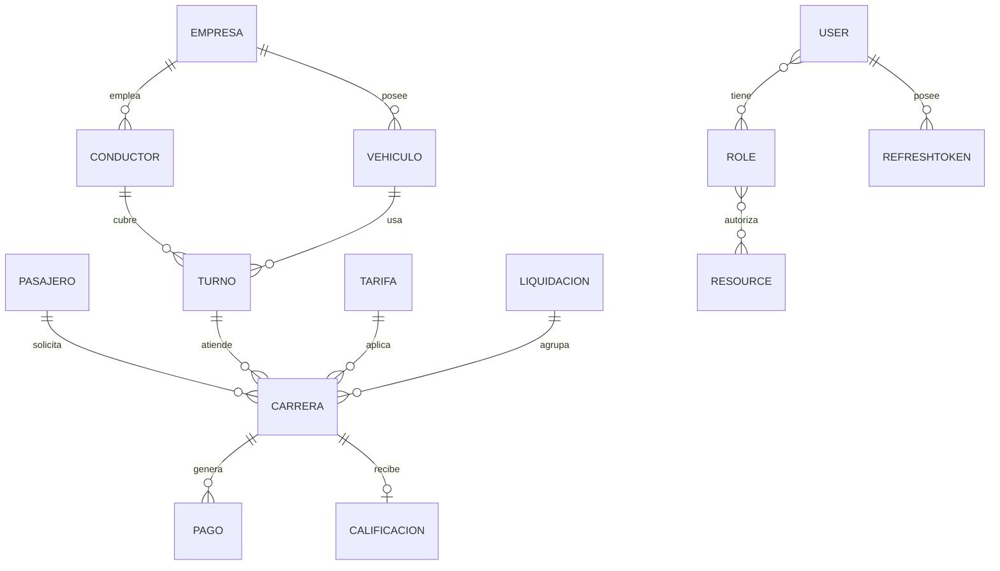

# SDD — MoviCab (pista IA · estudiante-proyecto9)

**Asignatura:** Desarrollo Web · 2026-II  
**Proyecto:** 09. MoviCab - Despacho inteligente de taxis  
**Autor:** Diego Armando De Luque Castillo (GitHub: DiegoDeluque15)

---

## M1 — Alineación

| Elemento | Decisión |
|---|---|
| Objetivo | Backend MoviCab con Clean Architecture, 16 entidades, sin auth en pista IA. |
| Entidades | Pasajero, Conductor, Empresa, Vehiculo, Turno, Tarifa, Carrera, Pago, Calificacion, Liquidacion, User, Role, RoleUser, Resource, ResourceRole, RefreshToken. |
| M2 | Este documento + `docs/Prompt.md` |
| M3 | `docs/kanban.md` — 12 issues, WIP=1 |
| M4 | IA como apoyo; revisión humana obligatoria — `docs/proceso.md` |
| M5 | Pruebas por capa (dominio, aplicación, API) |
| M6 | Gate semanal con evidencias |

---

## 1. Problema y actores

MoviCab despacha viajes automáticamente: solicitudes de pasajeros, conductores disponibles por turno/vehículo, ciclo de vida de carrera, tarifas protegidas, pagos, calificaciones y liquidaciones periódicas.

| Actor | Rol | Interacción |
|---|---|---|
| Pasajero | dato de negocio | Solicita carreras, califica |
| Conductor | CONDUCTOR | Ejecuta carreras |
| Despachador | DESPACHO | Asigna carreras |
| Administrador | ADMIN | Gestión total |
| Finanzas | FINANZAS | Pagos y liquidaciones |
| Soporte | SOPORTE | Incidencias |

---

## 2. Modelo de dominio

Ver entidades completas, invariantes y reglas CRUD en `docs/Prompt.md` §4 y §5 del SDD extendido del curso.

### Diagrama ER

---

## 3. Arquitectura por capas

Ver `docs/Prompt.md` §2–3.

Módulos business: `passengers`, `fleets`, `drivers`, `pricing`, `trips`, `settlements`.  
Módulos identity (solo datos): `users`, `roles`, `role-users`, `resources`, `resource-roles`, `refresh-tokens`.

---

## 4. Contratos API iniciales

| Operación | Ruta | Notas |
|---|---|---|
| Salud | `GET /api/health` | status + BD |
| Crear carrera | `POST /api/carreras` | total calculado en servidor |
| Cambiar estado | `PATCH /api/carreras/:id/estado` | máquina de estados |
| Tarifa vigente | `GET /api/tarifas/vigente` | fecha actual |
| Liquidación | `POST /api/liquidaciones` | agrupa carreras cerradas |

Ejemplos JSON completos en SDD del curso (sección 7).

---

## 5. Motor de BD

**MySQL** · base `movicab_db` · contenedor movicab-lab.

---

## 6. Trazabilidad implementación (pista IA)

| Issue | REQ cubiertos |
|---|---|
| ISS-01 | REQ-S04-05 (base NestJS) |
| ISS-02 | REQ-S04-05 (BD, logging, health) |
| ISS-03…11 | Entidades y reglas de negocio |
| ISS-12 | Swagger, demo, integración |

Estado Kanban: ver `docs/kanban.md`.
