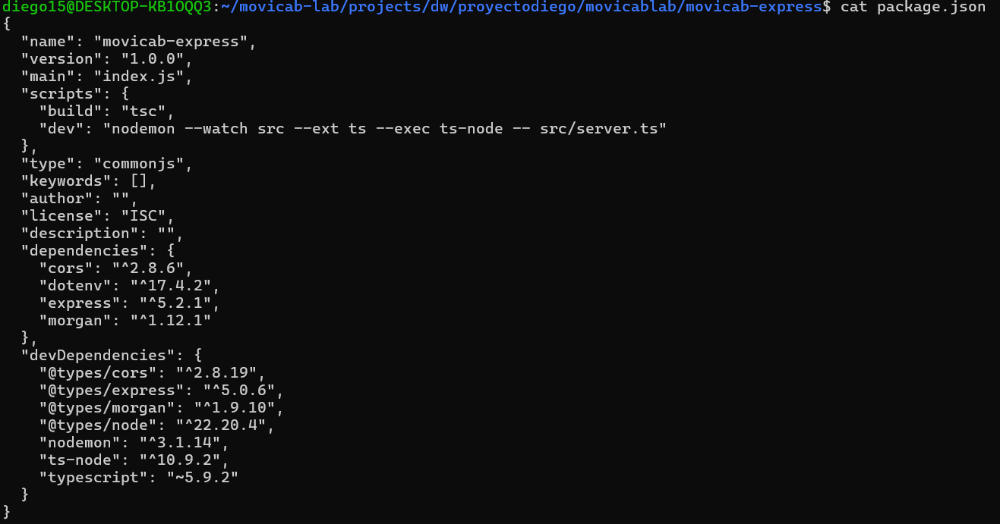
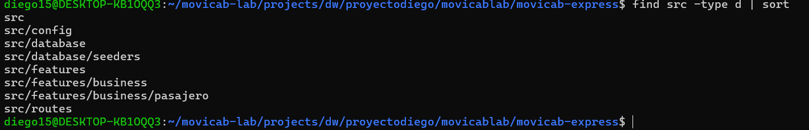
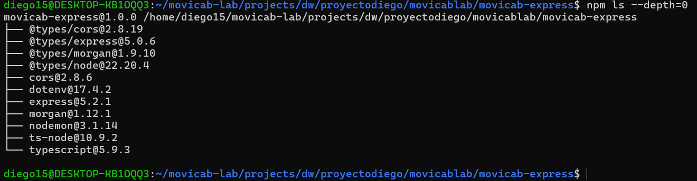
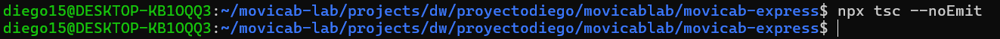
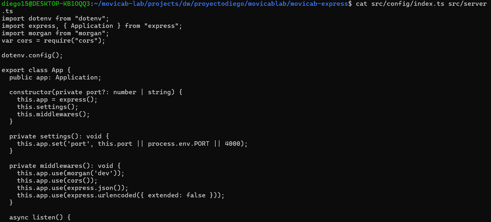

# Proceso — movicab-express

Bitácora cronológica de construcción del backend Express (arquitectura por features).
Cada entrada corresponde a un sub-ítem o ISS cerrado.

---

## ISS-01 / 2.1 — package.json
Fecha: 2026-09-26
Qué se hizo: se agregaron los scripts "build" (tsc) y "dev" (nodemon con ts-node sobre src/server.ts), y se fijó "type": "commonjs".

## ISS-01 / 2.2 — Estructura de carpetas
Fecha: 2026-09-26
Qué se hizo: se crearon src/config, src/database/seeders, src/routes y src/features/business/pasajero.

## ISS-01 / 2.3 — Dependencias base
Fecha: 2026-09-26
Qué se hizo: se instalaron express, cors, dotenv, morgan (producción) y typescript, ts-node, nodemon, @types/node, @types/express, @types/cors, @types/morgan (dev).

## ISS-01 / 2.4 — tsconfig.json
Fecha: 2026-09-26
Qué se hizo: se configuró target ES2020, module commonjs, rootDir ./src, outDir ./dist, strict true, con include src/**/*.ts.

## ISS-01 / 2.5 — Esqueleto de la app
Fecha: 2026-09-26
Qué se hizo: se creó src/config/index.ts (clase App: settings, middlewares con morgan/cors/express.json, método listen) y src/server.ts (arranque de App). Verificado con "npx tsc --noEmit" sin errores.

## ISS-01 / Cierre ISS-01 — Servidor corriendo
Fecha: 2026-09-26
Qué se hizo: se ejecutó "npm run dev" y el servidor levantó correctamente en el puerto configurado.

## ISS-02 / 3.1 — Drivers Sequelize y .env
Fecha: 2026-09-26
Qué se hizo: se instaló el ORM Sequelize, sus tipos y los drivers para MySQL, Postgres, MSSQL y Oracle. Se creó el archivo .env con la configuración de motores y base de datos (DB_ENGINE=mysql por defecto).
Evidencia: docs/evidencias/3.1-sequelize-env.png
