# Proceso — movicab-express

Bitácora cronológica de construcción del backend Express (arquitectura por features).
Cada entrada corresponde a un sub-ítem o ISS cerrado.

---

## ISS-01 / 2.1 — package.json
Fecha: 2026-09-26
Qué se hizo: se agregaron los scripts "build" (tsc) y "dev" (nodemon con ts-node sobre src/server.ts), y se fijó "type": "commonjs".
Evidencia: N/A (paso estructural)

## ISS-01 / 2.2 — Estructura de carpetas
Fecha: 2026-09-26
Qué se hizo: se crearon src/config, src/database/seeders, src/routes y src/features/business/pasajero.
Evidencia: N/A (paso estructural)

## ISS-01 / 2.3 — Dependencias base
Fecha: 2026-09-26
Qué se hizo: se instalaron express, cors, dotenv, morgan (producción) y typescript, ts-node, nodemon, @types/node, @types/express, @types/cors, @types/morgan (dev).
Evidencia: N/A (paso estructural)

## ISS-01 / 2.4 — tsconfig.json
Fecha: 2026-09-26
Qué se hizo: se configuró target ES2020, module commonjs, rootDir ./src, outDir ./dist, strict true, con include src/**/*.ts.
Evidencia: N/A (paso estructural)

## ISS-01 / 2.5 — Esqueleto de la app
Fecha: 2026-09-26
Qué se hizo: se creó src/config/index.ts (clase App: settings, middlewares con morgan/cors/express.json, método listen) y src/server.ts (arranque de App). Verificado con "npx tsc --noEmit" sin errores.
Evidencia: N/A (paso estructural)

## ISS-01 / Cierre ISS-01 — Servidor corriendo
Fecha: 2026-09-26
Qué se hizo: se ejecutó "npm run dev" y el servidor levantó correctamente en el puerto configurado.
Cómo capturarlo: ejecutar `npm run dev` y esperar ver en la terminal "Servidor ejecutándose en puerto 4000" (o el puerto configurado) sin errores de compilación.
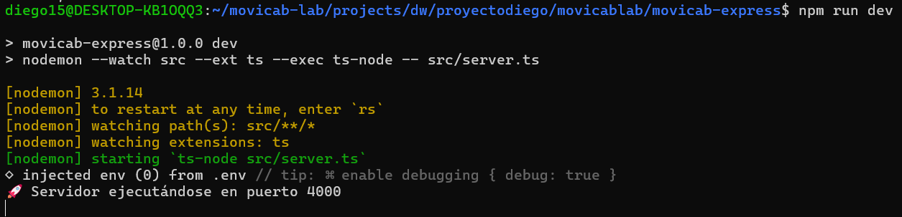

## ISS-02 / 3.1 — Drivers Sequelize y .env
Fecha: 2026-09-26
Qué se hizo: se instaló el ORM Sequelize, sus tipos y los drivers para MySQL, Postgres, MSSQL y Oracle. Se creó el archivo .env con la configuración de motores y base de datos (DB_ENGINE=mysql por defecto).
Evidencia: N/A (paso estructural)

## ISS-02 / 3.2 — Configuración Sequelize (database/db.ts)
Fecha: 2026-09-26
Qué se hizo: se creó src/database/db.ts con la instancia central de Sequelize, soportando múltiples motores vía variables de entorno, y funciones utilitarias de conexión.
Evidencia: N/A (paso estructural)

## ISS-02 / 3.3 — Carpeta seeders
Fecha: 2026-09-26
Qué se hizo: se creó la carpeta reservada src/database/seeders.
Evidencia: N/A (paso estructural)

## ISS-02 / Cierre ISS-02 — Servidor corriendo
Fecha: 2026-09-26
Qué se hizo: se ejecutó "npm run dev" y el servidor levantó correctamente sin errores tras configurar los drivers de BD.
Cómo capturarlo: ejecutar `npm run dev` y esperar ver "🔌 Conectando a base de datos: MYSQL" y "Servidor ejecutándose en puerto 4000" sin errores.
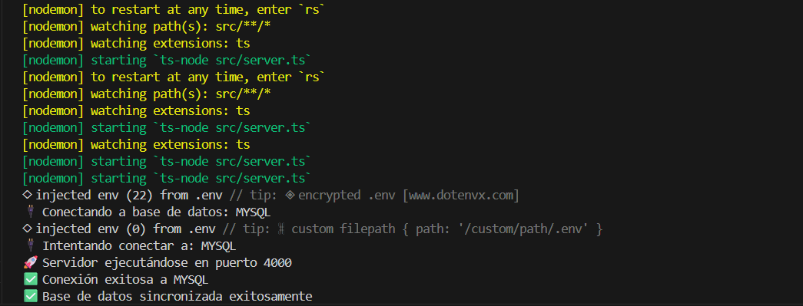

## ISS-03-A / 4.1 — Modelo Pasajero
Fecha: 2026-09-26
Qué se hizo: se creó src/features/business/pasajero/pasajero.model.ts con bcrypt para encriptar contraseñas.
Evidencia: N/A (paso estructural)

## ISS-03-A / 4.2 — Esqueleto controller / routes + carpeta http
Fecha: 2026-09-26
Qué se hizo: se crearon pasajero.controller.ts y pasajero.routes.ts (esqueleto vacío) y la carpeta src/features/business/pasajero/http/.
Evidencia: N/A (paso estructural)

## ISS-03-A / 4.3 — Agregador Routes + cableado en Config
Fecha: 2026-09-26
Qué se hizo: se creó src/routes/index.ts con clase Routes/pasajeroRoutes. Se parcheó src/config/index.ts: imports de db/modelo/Routes, propiedad routePrv, métodos routes() y dbConnection() con sync alter:true.
Evidencia: N/A (paso estructural)

## ISS-03-B / 5.1 — GetAll y GetOne (Pasajero)
Fecha: 2026-09-27
Qué se hizo: se implementaron los métodos getAll y getOne en pasajero.controller.ts, se registraron las rutas GET en pasajero.routes.ts y se creó el archivo HTTP para pruebas, excluyendo el campo password de las respuestas.
Cómo capturarlo: ejecutar `npm run dev` en una terminal y en otra ejecutar `curl -s http://localhost:4000/api/pasajeros` y `curl -s http://localhost:4000/api/pasajeros/1`. Debe verse un array vacío y un error 404 respectivamente.
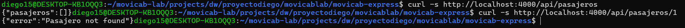
## ISS-03-C / 6.1 — Crear pasajero
Fecha: 2026-09-27
Qué se hizo: se implementó el método create en pasajero.controller.ts, se registró la ruta POST /api/pasajeros en pasajero.routes.ts y se creó el archivo HTTP pasajeros.create.http.
Cómo capturarlo: ejecutar `npm run dev` en una terminal y en otra ejecutar `curl -s -X POST http://localhost:4000/api/pasajeros -H 'Content-Type: application/json' -d '{"name":"Ana","phone":"3001","email":"ana@test.com","password":"Password123!","status":"active"}'`. Debe retornar HTTP 201 con el pasajero recién creado y sin la contraseña en la respuesta.
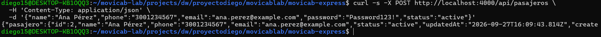

## ISS-03-D / 7.1 — Update PUT y PATCH (Pasajero)
Fecha: 2026-09-27
Qué se hizo: se implementaron los métodos updatePut y updatePatch en pasajero.controller.ts, se registraron las rutas PUT y PATCH /api/pasajeros/:id en pasajero.routes.ts, y se creó pasajeros.update.http. La respuesta excluye siempre el campo password.
Cómo capturarlo: ejecutar `npm run dev` y luego, en otra terminal, `curl -s -X PUT http://localhost:4000/api/pasajeros/1 -H 'Content-Type: application/json' --data-raw '{"name":"Ana Actualizada","address":"Carrera 15","phone":"3009876543","email":"ana@test.com","status":"active"}'` y `curl -s -X PATCH http://localhost:4000/api/pasajeros/1 -H 'Content-Type: application/json' --data-raw '{"phone":"3011112233"}'`. Deben retornar 200 con el registro actualizado y sin password.
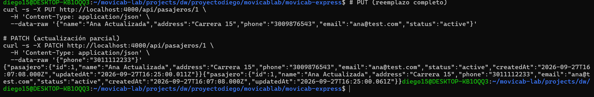

## ISS-03-E / 8.1 — Delete fisico y logico (Pasajero)
Fecha: 2026-09-27
Que se hizo: se implementaron deletePhysical (DELETE /api/pasajeros/:id — borrado permanente) y deleteLogical (PATCH /api/pasajeros/:id/deactivate — status = inactive). Se verifico: tras borrado logico el registro desaparece del GET /api/pasajeros (filtra active), pero queda en la tabla; tras borrado fisico se elimina de la BD. La respuesta nunca expone el password.
Como capturarlo: ejecutar `npm run dev`, crear un pasajero con POST /api/pasajeros y anotar el id. Luego ejecutar `curl -s -X PATCH http://localhost:4000/api/pasajeros/<id>/deactivate` para el borrado logico y verificar con `curl -s http://localhost:4000/api/pasajeros` que ya no aparece. Despues `curl -s -X DELETE http://localhost:4000/api/pasajeros/<id>` para el borrado fisico y confirmar con GET que la lista queda vacia.
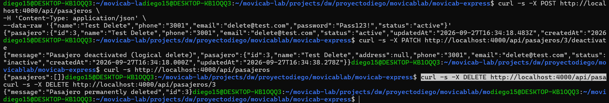
## ISS-06 / 11.1 — Modelo TipoVehiculo
Fecha: 2026-09-27
Qué se hizo: se creó el modelo TipoVehiculo en tipo-vehiculo.model.ts con los campos (name, description, status) y timestamps activos. Se importó el modelo en src/config/index.ts para su sincronización con la base de datos (Sequelize).
Evidencia: N/A (paso estructural, sin captura)
## ISS-06 / 11.2-A — GetAll y GetOne (TipoVehiculo)
Fecha: 2026-09-27
Qué se hizo: se creó tipo-vehiculo.controller.ts con los métodos getAll y getOne, tipo-vehiculo.routes.ts con las rutas GET, http/tipos-vehiculo.get.http, y se cableó en src/routes/index.ts y src/config/index.ts.
Cómo capturarlo: ejecutar `npm run dev` y en otra terminal `curl -s http://localhost:4000/api/tipos-vehiculo | python3 -m json.tool` (debe retornar array vacío) y `curl -s http://localhost:4000/api/tipos-vehiculo/999 | python3 -m json.tool` (debe retornar 404).
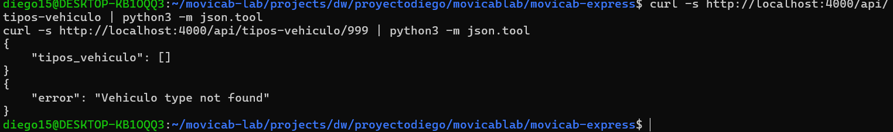
## ISS-06 / 11.2-B — Create POST (TipoVehiculo)
Fecha: 2026-09-27
Qué se hizo: se agregó el método create en tipo-vehiculo.controller.ts, se registró la ruta POST /api/tipos-vehiculo en tipo-vehiculo.routes.ts, y se creó http/tipos-vehiculo.create.http. Verificado: retorna 201 con el registro recién creado (id=1 en BD).
Cómo capturarlo: ejecutar `npm run dev` y en otra terminal `curl -s -X POST http://localhost:4000/api/tipos-vehiculo -H 'Content-Type: application/json' --data-raw '{"name":"Sedan","description":"Vehiculo de 4 puertas","status":"active"}' | python3 -m json.tool`. Debe retornar 201 con el objeto creado.
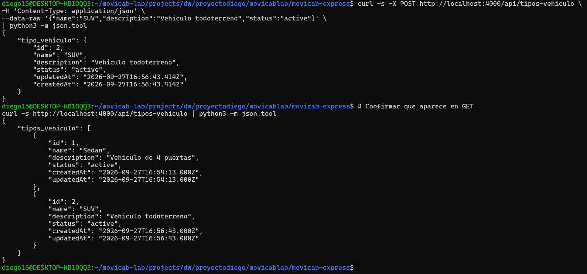
## ISS-06 / 11.2-C — Update PUT y PATCH (TipoVehiculo)
Fecha: 2026-09-27
Qué se hizo: se agregaron los métodos updatePut y updatePatch en tipo-vehiculo.controller.ts, se registraron las rutas PUT y PATCH /api/tipos-vehiculo/:id en tipo-vehiculo.routes.ts, y se creó http/tipos-vehiculo.update.http. La respuesta retorna el registro actualizado con 200.
Cómo capturarlo: ejecutar `npm run dev` y luego `curl -s -X PUT http://localhost:4000/api/tipos-vehiculo/1 -H 'Content-Type: application/json' --data-raw '{"name":"Sedan Actualizado","description":"Categoria renovada","status":"active"}' | python3 -m json.tool` y `curl -s -X PATCH http://localhost:4000/api/tipos-vehiculo/2 -H 'Content-Type: application/json' --data-raw '{"description":"Descripcion parcial actualizada"}' | python3 -m json.tool`. Deben retornar 200 con el registro actualizado.
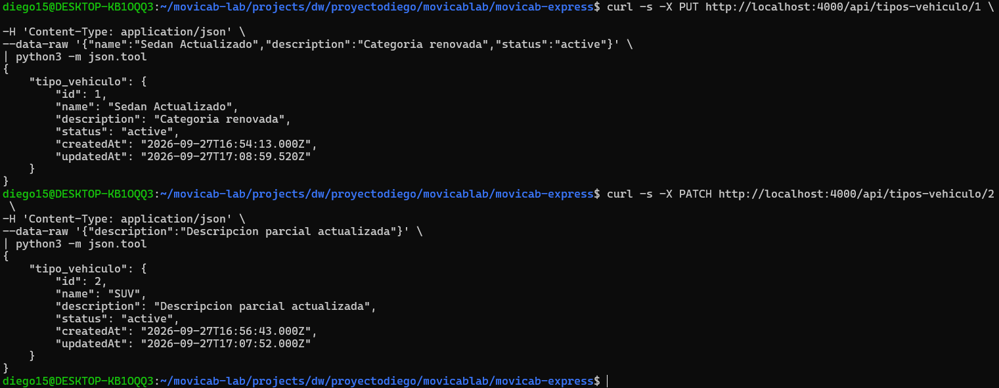
## ISS-06 / 11.2-D — Delete (TipoVehiculo)
Fecha: 2026-09-27
Qué se hizo: se agregaron los métodos deletePhysical y deleteLogical en tipo-vehiculo.controller.ts, las rutas DELETE /api/tipos-vehiculo/:id y PATCH /api/tipos-vehiculo/:id/deactivate en tipo-vehiculo.routes.ts, y el archivo http/tipos-vehiculo.delete.http. Verificado: borrado lógico oculta el registro en el GET (lo marca como inactive) y el físico lo borra por completo de la BD.
Cómo capturarlo: ejecutar `npm run dev` y en otra terminal crear un registro de prueba (ej. id 5): `curl -s -X POST http://localhost:4000/api/tipos-vehiculo -H 'Content-Type: application/json' --data-raw '{"name":"Borrar","status":"active"}' | python3 -m json.tool`. Luego hacer delete físico: `curl -s -X DELETE http://localhost:4000/api/tipos-vehiculo/5 | python3 -m json.tool` y confirmar con `curl -s http://localhost:4000/api/tipos-vehiculo | python3 -m json.tool` que ya no está.
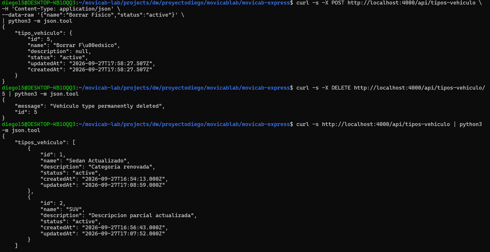
## ISS-04 — Seeders con Faker
Fecha: 2026-10-03
Qué se hizo: se crearon los seeders `pasajero.seeder.ts` y `tipo-vehiculo.seeder.ts` con @faker-js/faker, el archivo `counts.ts` con las cantidades por defecto (10 pasajeros, 25 tipos de vehículo), y el runner orquestador `database/seeders/index.ts` que los ejecuta en orden y es idempotente (si ya hay datos, los omite en vez de duplicar).
Por qué: en vez de crear datos de prueba a mano uno por uno con curl cada vez que se reinicia la base, se necesita una forma repetible y automática de poblarla con datos realistas.
Qué función cumple: es la capa de datos de prueba del backend — se ejecuta con `npm run db:seed` y deja la base lista para probar cualquier endpoint sin pasos manuales previos.
Para qué sirve: acelera el desarrollo y las pruebas (ya no hay que crear pasajeros/tipos de vehículo a mano antes de probar otras features), y es evidencia de que el backend puede arrancar desde una base vacía y quedar operativo solo.
Evidencia: evidencias/iss-04-seed-idempotente.png
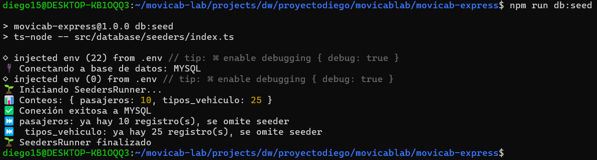

## ISS-05 — Swagger / OpenAPI (feature + registry externo)
Fecha: 2026-10-03
Qué se hizo: se crearon los módulos de documentación OpenAPI `pasajero.swagger.ts` y `tipo-vehiculo.swagger.ts` dentro de cada feature, el registry externo `src/swagger/index.ts` que los fusiona en un solo documento OpenAPI 3.0.3, y se cableó en `config/index.ts` con el método `docs()`. Se instalaron `swagger-ui-express` y `@types/swagger-ui-express`. Swagger UI queda montado en `/api/docs` y el JSON en `/api/docs.json`.
Por qué: sin documentación interactiva, cualquier persona que quiera consumir o probar el API tiene que adivinar los endpoints leyendo código fuente o archivos `.http`. Swagger genera una interfaz visual explorable donde se puede ver cada ruta, sus parámetros, schemas y hasta probar las peticiones en vivo.
Qué función cumple: es la capa de documentación viva del backend — cada feature exporta su propio módulo swagger y el registry los fusiona automáticamente, siguiendo el mismo patrón de orquestación externa que los seeders. Al agregar una nueva entidad, basta con crear su `.swagger.ts` e importarlo en el registry.
Para qué sirve: permite a cualquier desarrollador (o al profesor) abrir `/api/docs` en el navegador y ver de un vistazo todos los endpoints disponibles, sus schemas, y probarlos sin herramientas externas. También sirve como contrato formal del API para integraciones futuras con el frontend.
Evidencia: evidencias/iss-05-swagger-ui.png
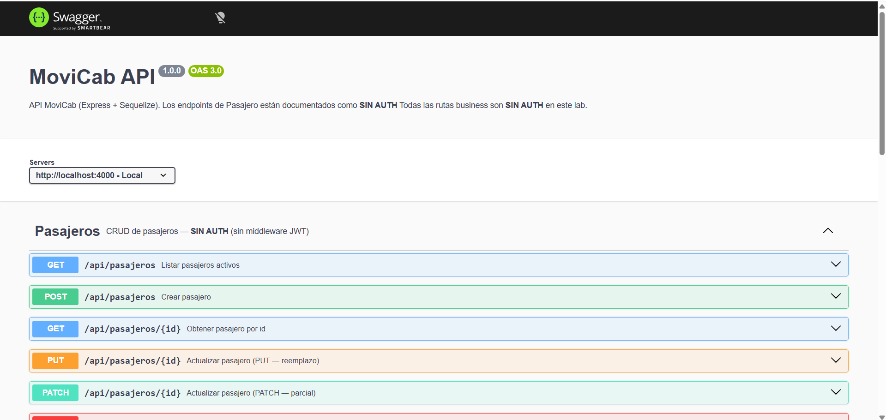

## ISS-07 — Feature Empresa (CRUD completo + seeder + swagger)
Fecha: 2026-10-03
Qué se hizo: se creó el feature completo `empresa` dentro de `src/features/business/empresa/`, con los archivos `empresa.model.ts` (tabla `empresas`, campos nit UNIQUE, razon_social, contacto_principal, status), `empresa.controller.ts` con los 7 métodos CRUD (getAll, getOne, create, updatePut, updatePatch, deletePhysical, deleteLogical), `empresa.routes.ts` cableando todas las rutas REST. Se agregó validación de nit duplicado en create y update que devuelve 409 antes de tocar la BD. También se creó `empresa.seeder.ts` con Faker (nit numérico único, razon_social con faker.company.name()), cableado en `counts.ts` (15 por defecto) y en `database/seeders/index.ts`. Se documentó en `empresa.swagger.ts` (7 endpoints + 4 schemas) y se registró en `src/swagger/index.ts`. Se crearon los 4 archivos `.http` de prueba en `http/`. Se cableó el modelo en `config/index.ts` y las rutas en `routes/index.ts`.
Por qué: Empresa es la primera entidad con invariante de negocio real (nit único), lo que exige ir más allá del CRUD básico — la validación se hace a nivel de aplicación (no solo en la BD con UNIQUE) para poder devolver un 409 descriptivo en vez de dejar que Sequelize lance una excepción de constraint no controlada. Esto establece el patrón que se usará en todas las entidades con campos únicos (Conductor con licencia, Usuario con email, etc.).
Qué función cumple: es la entidad raíz del lado empresarial del sistema — sirve de padre para Conductor (FK empresaId nullable). Sin Empresa, no es posible registrar conductores asociados a una flota, ni vincular viajes a empresas. Su CRUD completo deja todo listo para que ISS-08 (Conductor) pueda enlazarse via FK.
Para qué sirve: permite registrar y gestionar las empresas de transporte que operan en MoviCab. A nivel de desarrollo, el 409 de nit duplicado es el primer ejemplo de lógica de negocio real (más allá de 404/500) implementada en el backend, y sirve como referencia para todas las validaciones de unicidad futuras.
Evidencia: evidencias/iss-07-empresa-crud-409.png
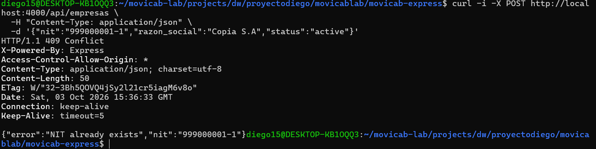

## ISS-08 — Feature Conductor + relación Empresa
Fecha: 2026-10-03
Qué se hizo: se implementó el feature completo `conductor` (`src/features/business/conductor/`). Se creó el modelo `conductor.model.ts` con la clave foránea `empresa_id` (nullable). En `conductor.controller.ts` se implementaron los 7 métodos CRUD, añadiendo validaciones en `create` y `update` para garantizar que si se envía `empresa_id`, la Empresa referenciada exista y su status sea `active` (devolviendo 404 o 400 respectivamente). Se definieron las rutas REST en `conductor.routes.ts` y las asociaciones (`Conductor.belongsTo(Empresa)` y `Empresa.hasMany(Conductor)`) en `conductor.associations.ts`, cableadas luego en `config/index.ts`. Adicionalmente, se creó un seeder con Faker (`conductor.seeder.ts`) que asigna un `empresa_id` aleatorio existente, ejecutándose después del seeder de Empresa; y se documentaron todos los endpoints en Swagger (`conductor.swagger.ts`).
Por qué: Esta es la primera entidad que incluye una relación foránea hacia otra (Empresa). No basta con el constraint SQL en la BD; la regla de negocio dicta que no se pueden asignar conductores a empresas inactivas. Esto requiere validar la integridad referencial y el estado a nivel de controlador de manera controlada (404/400).
Qué función cumple: Conductor es un pilar fundamental del dominio. Se enlaza a Empresa (a la que pertenece la flota) y luego será padre de Turno y Vehículo. Este feature provee las operaciones REST básicas para gestionar el catálogo de conductores.
Para qué sirve: Permite a los administradores registrar y administrar conductores, asignándolos opcionalmente a empresas (si forman parte de una flota). La validación garantiza que no existan inconsistencias (conductores apuntando a empresas fantasma o desactivadas).
Evidencia: evidencias/iss-08-conductor-crud.png
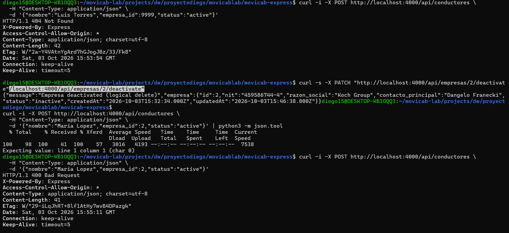

## ISS-09 — Feature Vehiculo + relación Empresa / TipoVehiculo
Fecha: 2026-10-03
Qué se hizo: se implementó el feature completo `vehiculo` en `src/features/business/vehiculo/`. Se creó `vehiculo.model.ts` con dos claves foráneas: `empresa_id` (obligatoria, FK → `empresas.id`) y `tipo_vehiculo_id` (nullable, FK → `tipos_vehiculo.id`). En `vehiculo.controller.ts` se implementaron los 7 métodos CRUD con dos helpers de validación independientes: `validateEmpresaId` (verifica existencia y `status: active`, devuelve 404 o 400) y `validateTipoVehiculoId` (solo verifica existencia, devuelve 404 porque `TipoVehiculo` no tiene regla de negocio sobre `status`). El `getAll` y `getOne` incluyen `empresa` y `tipo` anidados en la respuesta. Se creó `vehiculo.associations.ts` con las cuatro asociaciones Sequelize (`Vehiculo.belongsTo(Empresa)`, `Empresa.hasMany(Vehiculo)`, `Vehiculo.belongsTo(TipoVehiculo, { as: 'tipo' })`, `TipoVehiculo.hasMany(Vehiculo)`) cableadas en `config/index.ts`. El seeder `vehiculo.seeder.ts` utiliza `faker.vehicle.vehicle()` para el nombre y asigna `empresa_id` obligatorio de las empresas activas ya sembradas, y `tipo_vehiculo_id` de forma opcional (50% probabilidad de ser null). Se documentó todo en `vehiculo.swagger.ts` y se registró en el registry de Swagger. Se cableó también en `routes/index.ts`, `counts.ts` (20 por defecto) y en `database/seeders/index.ts` (después de Empresa y TipoVehiculo).
Por qué: Vehiculo es la segunda entidad con FK obligatoria (la primera con FK no nullable), lo que requiere una validación más estricta en el create (se rechaza sin empresa_id antes de tocar la BD). Además es la primera entidad con dos FKs de distinto tipo: una con validación de estado de negocio (Empresa debe ser active) y otra puramente referencial (TipoVehiculo solo debe existir). Este dualismo establece el patrón diferenciado de validación que usarán Turno y Carrera.
Qué función cumple: Vehiculo es el activo físico del sistema. Se enlaza a la flota de una empresa y se categoriza por tipo. Será hijo de Turno junto con Conductor, completando el trío mínimo para crear un servicio de transporte operativo.
Para qué sirve: Permite registrar y gestionar la flota de vehículos disponibles para los turnos. Al incluir empresa_id obligatoria, garantiza que cada vehículo pertenece a una empresa activa. El campo tipo_vehiculo_id opcional permite clasificar la flota sin hacerlo mandatorio desde el inicio.
Evidencia: evidencias/iss-09-vehiculo-crud.png
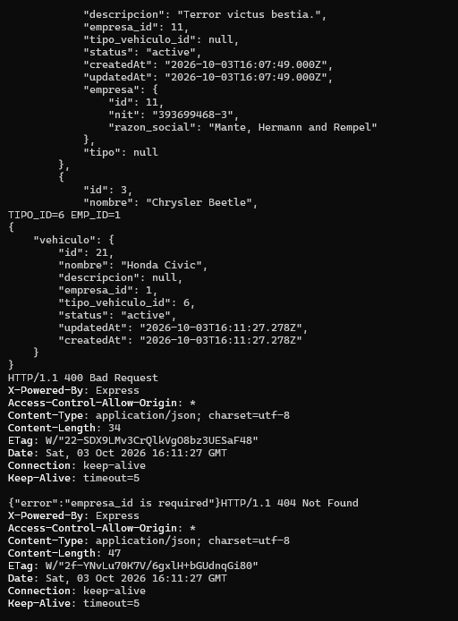

## ISS-10 — Feature Turno + relación Conductor/Vehiculo
Fecha: 2026-10-03
Qué se hizo: se implementó el feature `turno` con su modelo, asociaciones (Conductor 1:N Turno, Vehiculo 1:N Turno), CRUD, validaciones y seeder. Se programó la regla de negocio crítica "regla de unicidad": antes de crear o reactivar un turno, se verifica que el conductor y el vehículo no estén ya asignados a otro turno `active` (retornando 409 Conflict si lo están). El seeder fue programado para iterar simultáneamente listas de conductores y vehículos activos y emparejarlos sin repetir, garantizando que los turnos generados inicialmente respeten esta unicidad en la base de datos. Swagger configurado y las pruebas validaron con éxito los casos válidos, fallos de FK y conflicto 409.
Por qué: Para poder asignar conductores a vehículos formando unidades operativas (turnos) capaces de aceptar carreras, evitando cruces (un conductor no puede manejar dos vehículos a la vez y un vehículo no puede ser manejado por dos conductores simultáneamente).
Qué función cumple: Sirve de puente temporal entre un conductor activo y un vehículo activo. El `deactivate` de un turno libera inmediatamente los activos para conformar un nuevo turno.
Para qué sirve: Prepara la base para el ISS-11 (Carrera), ya que los viajes se asignan a turnos vigentes y no a conductores sueltos.
Evidencia: evidencias/iss-10-turno-crud.png
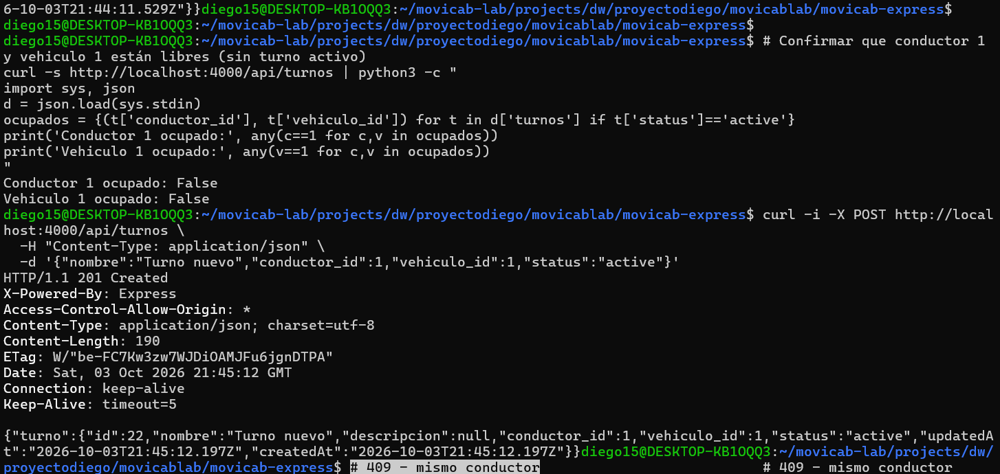
